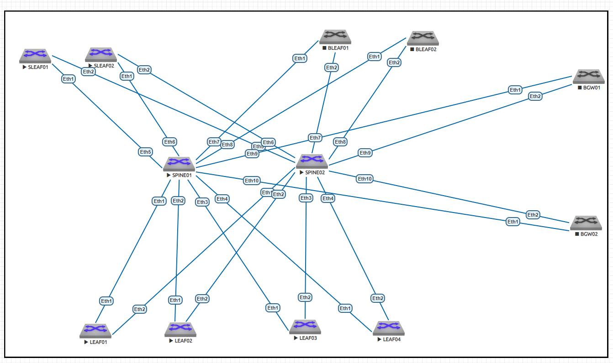

# Настройка OSPF в Underlay

### Цель:
Настройка OSPF в Underlay на фабрике. 
Настроить IP на всех активных портах (PtP линки и loopback1) для дальнейшей работы над проектом. 
Адресное пространство должно быть задокументировано. 

### Принципы назначения IP адресов, адресное пространство
Описаны в документе: [README.md](README.md)

### Итоговая схема

## Конфигурации устройств:

|                             |                               |                            |                        |
|-----------------------------|-------------------------------|----------------------------|------------------------|
| [SPINE01.cfg](SPINE01.txt.txt)  |   [BLEAF01.cfg](BLEAF01.txt.txt)  | [SLEAF01.cfg](SLEAF01.txt.txt) | [BGW01.cfg](BGW01.txt.txt) |
| [SPINE02.cfg](SPINE02.txt.txt)  |   [BLEAF02.cfg](BLEAF02.txt.txt)  | [SLEAF02.cfg](SLEAF02.txt.txt) | [BGW02.cfg](BGW02.txt.txt) |
| [LEAF01.cfg](LEAF01.txt.txt)    |-------------------------------|----------------------------|------------------------|
| [LEAF02.cfg](LEAF02.txt.txt)    |-------------------------------|----------------------------|------------------------|
| [LEAF03.cfg](LEAF03.txt.txt)    |-------------------------------|----------------------------|------------------------|
| [LEAF04.cfg](LEAF04.txt.txt)    |-------------------------------|----------------------------|------------------------|

## Мощности стенда не хватало для работы BFD пришлось отключить часть устройств.

## Подтверждение работоспособности Топологии:

### show bfd peers

#### dc01-pod01-spine01#
dc01-pod01-spine01#show bfd peers

VRF name: default

|DstAddr   |MyDisc     |YourDisc   |Interface/Transport |Type   |LastUp         |      |
|----------|-----------|-----------|--------------------|-------|---------------|------|
|10.11.3.1 |781865319  |905301080  |Ethernet1(17)       |normal |12/03/24       |09:09 |
|10.11.3.3 |702803546  |1777991436 |Ethernet2(18)       |normal |12/03/24       |09:10 |
|10.11.3.5 |2852931168 |4184444231 |Ethernet3(19)       |normal |12/03/24       |09:09 |
|10.11.3.7 |1000268329 |1038889858 |Ethernet4(20)       |normal |12/03/24       |09:09 |
|10.11.3.9 |289015528  |2075822374 |Ethernet5(21)       |normal |12/03/24       |10:01 |
|10.11.3.11|1896418641 |1954307089 |Ethernet6(22)       |normal |12/03/24       |10:01 |

|              |LastDown           |LastDiag          |State |
|--------------|-------------------|------------------|------|
|              |NA                 |No      Diagnostic|Up    |
|              |NA                 |No      Diagnostic|Up    |
|              |NA                 |No      Diagnostic|Up    |
|              |NA                 |No      Diagnostic|Up    |
|              |NA                 |No      Diagnostic|Up    |
|              |NA                 |No      Diagnostic|Up    |

#### dc01-pod01-spine02#

dc01-pod01-spine02#show bfd peers

VRF name: default

|DstAddr   |MyDisc    |YourDisc   |Interface/Transport |Type   |LastUp         |      |
|----------|----------|-----------|--------------------|-------|---------------|------|
|10.11.3.41|2699976320|1472873612 |Ethernet1(16)       |normal |12/03/24       |09:09 |
|10.11.3.43|3395767375|716321651  |Ethernet2(17)       |normal |12/03/24       |09:09 |
|10.11.3.45|2063858295|3974180735 |Ethernet3(18)       |normal |12/03/24       |09:09 |
|10.11.3.47|1302925306|534778853  |Ethernet4(19)       |normal |12/03/24       |09:09 |
|10.11.3.49|1467659710|3491795341 |Ethernet5(20)       |normal |12/03/24       |10:01 |
|10.11.3.51|4145999257|1541684558 |Ethernet6(21)       |normal |12/03/24       |10:01 |

|              |LastDown           |LastDiag|State     |      |
|--------------|-------------------|--------|----------|------|
|              |NA                 |No      |Diagnostic|Up    |
|              |NA                 |No      |Diagnostic|Up    |
|              |NA                 |No      |Diagnostic|Up    |
|              |NA                 |No      |Diagnostic|Up    |
|              |NA                 |No      |Diagnostic|Up    |
|              |NA                 |No      |Diagnostic|Up    |

### show isis neighbors

#### dc01-pod01-spine01#

show isis neighbors

|Instance|VRF    |System |Id  |Type     |Interface SNPA|State|Hold time|Circuit Id |
|--------|-------|-------|----|---------|--------------|-----|---------|----|
|ZEUS    |default|LEAF01 |L1L2|Ethernet1|P2P           |UP   |25       |0D  |   
|ZEUS    |default|LEAF02 |L1L2|Ethernet2|P2P           |UP   |22       |0D  |    
|ZEUS    |default|LEAF03 |L1L2|Ethernet3|P2P           |UP   |28       |0D  |    
|ZEUS    |default|LEAF04 |L1L2|Ethernet4|P2P           |UP   |21       |0D  |    
|ZEUS    |default|SLEAF01|L1L2|Ethernet5|P2P           |UP   |26       |0E  |    
|ZEUS    |default|SLEAF02|L1L2|Ethernet6|P2P           |UP   |23       |0E  |    

#### dc01-pod01-spine02#

show isis neighbors

|Instance|VRF    |System Id  |Type|Interface|SNPA|State|Hold time|Circuit Id |
|--------|-------|-----------|----|---------|----|----|----------|----|
|ZEUS    |default|LEAF01     |L1L2|Ethernet1|P2P |UP  |26        |0E  |    
|ZEUS    |default|LEAF02     |L1L2|Ethernet2|P2P |UP  |30        |0E  |    
|ZEUS    |default|LEAF03     |L1L2|Ethernet3|P2P |UP  |24        |0E  |    
|ZEUS    |default|LEAF04     |L1L2|Ethernet4|P2P |UP  |24        |0E  |    
|ZEUS    |default|SLEAF01    |L1L2|Ethernet5|P2P |UP  |23        |0F  |    
|ZEUS    |default|SLEAF02    |L1L2|Ethernet6|P2P |UP  |25        |0F  |   
