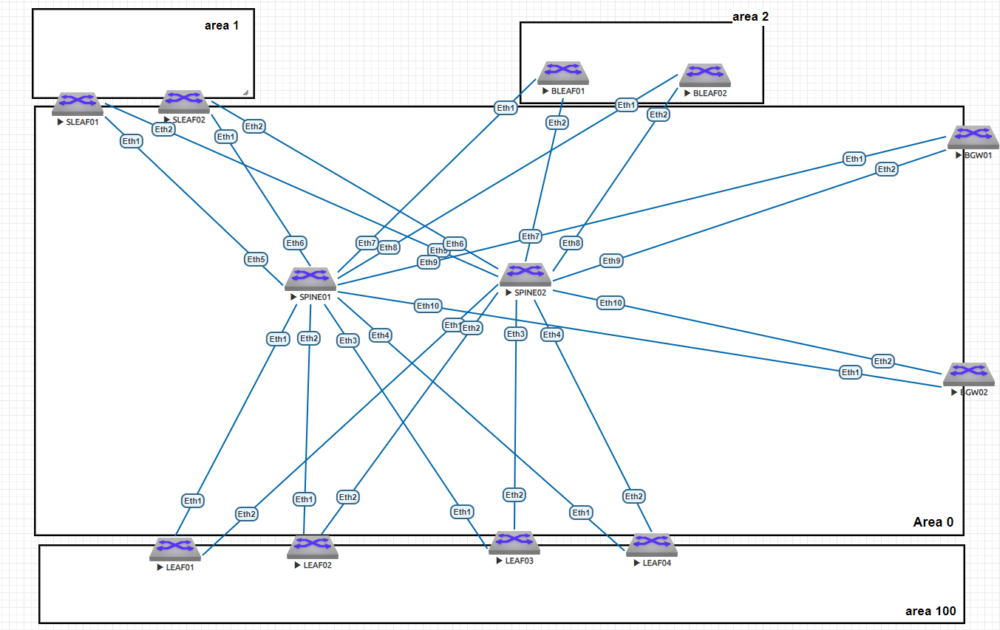

# Настройка OSPF в Underlay

### Цель:
Настройка OSPF в Underlay на фабрике. 
Настроить IP на всех активных портах (PtP линки и loopback1) для дальнейшей работы над проектом. 
Адресное пространство должно быть задокументировано. 

### Принципы назначения IP адресов, адресное пространство
Описаны в документе: [README.md](README.md)

### Итоговая схема

## Конфигурации устройств:

|                             |                               |                            |                        |
|-----------------------------|-------------------------------|----------------------------|------------------------|
| [SPINE01.cfg](SPINE01.cfg)  |   [BLEAF01.cfg](BLEAF01.cfg)  | [SLEAF01.cfg](SLEAF01.cfg) | [BGW01.cfg](BGW01.cfg) |
| [SPINE02.cfg](SPINE02.cfg)  |   [BLEAF02.cfg](BLEAF02.cfg)  | [SLEAF02.cfg](SLEAF02.cfg) | [BGW02.cfg](BGW02.cfg) |
| [LEAF01.cfg](LEAF01.cfg)    |-------------------------------|----------------------------|------------------------|
| [LEAF02.cfg](LEAF02.cfg)    |-------------------------------|----------------------------|------------------------|
| [LEAF03.cfg](LEAF03.cfg)    |-------------------------------|----------------------------|------------------------|
| [LEAF04.cfg](LEAF04.cfg)    |-------------------------------|----------------------------|------------------------|

## Подтверждение работоспособности Топологии:

### show ip ospf neighbor

#### dc01-pod01-spine01#
dc01-pod01-spine01#show ip ospf neighbor

|Neighbor  |ID |Instance VRF|Pri|State |  Dead Time |Address | Interface | | |
|----------|---|--------|---|----|--------|----------|----------|-------|---------|
|10.11.1.3 |1  |default |0  |FULL|00:00:38|10.11.3.1 |Ethernet1 |       |         |
|10.11.1.4 |1  |default |0  |FULL|00:00:33|10.11.3.3 |Ethernet2 |       |         |
|10.11.1.5 |1  |default |0  |FULL|00:00:34|10.11.3.5 |Ethernet3 |       |         |
|10.11.1.6 |1  |default |0  |FULL|00:00:30|10.11.3.7 |Ethernet4 |       |         |
|10.11.1.7 |1  |default |0  |FULL|00:00:34|10.11.3.9 |Ethernet5 |       |         |
|10.11.1.8 |1  |default |0  |FULL|00:00:34|10.11.3.11|Ethernet6 |       |         |
|10.11.1.9 |1  |default |0  |FULL|00:00:31|10.11.3.13|Ethernet7 |       |         |
|10.11.1.10|1  |default |0  |FULL|00:00:32|10.11.3.15|Ethernet8 |       |         |
|10.11.1.12|1  |default |0  |FULL|00:00:35|10.11.3.19|Ethernet10|       |         |
|10.11.1.11|1  |default |0  |FULL|00:00:31|10.11.3.17|Ethernet9 |       |         |

#### dc01-pod01-spine02#

dc01-pod01-spine02#show ip ospf neighbor

|Neighbor  |ID |Instance VRF|Pri|State |  Dead Time |Address | Interface | | |
|----------|---|--------|---|----|--------|----------|----------|-------|---------|
|10.11.1.3 |1  |default |0  |FULL|00:00:35|10.11.3.41|Ethernet1 |       |         |
|10.11.1.4 |1  |default |0  |FULL|00:00:31|10.11.3.43|Ethernet2 |       |         |
|10.11.1.7 |1  |default |0  |FULL|00:00:33|10.11.3.49|Ethernet5 |       |         |
|10.11.1.8 |1  |default |0  |FULL|00:00:32|10.11.3.51|Ethernet6 |       |         |
|10.11.1.9 |1  |default |0  |FULL|00:00:33|10.11.3.53|Ethernet7 |       |         |
|10.11.1.10|1  |default |0  |FULL|00:00:32|10.11.3.55|Ethernet8 |       |         |
|10.11.1.11|1  |default |0  |FULL|00:00:29|10.11.3.57|Ethernet9 |       |         |
|10.11.1.12|1  |default |0  |FULL|00:00:30|10.11.3.59|Ethernet10|       |         |
|10.11.1.5 |1  |default |0  |FULL|00:00:33|10.11.3.45|Ethernet3 |       |         |
|10.11.1.6 |1  |default |0  |FULL|00:00:29|10.11.3.47|Ethernet4 |       |         |

### show ip ospf database

#### dc01-pod01-spine01#

show ip ospf database

OSPF Router with ID(10.11.1.1) (Instance ID 1) (VRF default)

Router Link States (Area 0.0.0.0)

|Link ID   |ADV Router|Age |Seq#      |Checksum  | Link count ||||
|----------|----------|----|----------|------|--------|--------|----|-----|
|10.11.1.2 |10.11.1.2 |6   |0x80004a91|0xfabe|12      |        |    |     |
|10.11.1.4 |10.11.1.4 |5   |0x800010c4|0x35cf|4       |        |    |     |
|10.11.1.8 |10.11.1.8 |8   |0x8000114b|0x4b89|3       |        |    |     |
|10.11.1.12|10.11.1.12|5   |0x80000c83|0xd1e |4       |        |    |     |
|10.11.1.6 |10.11.1.6 |9   |0x800010ea|0x6ad9|3       |        |    |     |
|10.11.1.10|10.11.1.10|10  |0x80000d5b|0x5466|3       |        |    |     |
|10.11.1.3 |10.11.1.3 |14  |0x8000110b|0x6e10|5       |        |    |     |
|10.11.1.5 |10.11.1.5 |21  |0x800010e4|0x3f50|5       |        |    |     |
|10.11.1.9 |10.11.1.9 |10  |0x80000ce9|0xb182|3       |        |    |     |
|10.11.1.1 |10.11.1.1 |1   |0x80004dda|0x8234|16      |        |    |     |
|10.11.1.7 |10.11.1.7 |3   |0x800010dc|0x7160|4       |        |    |     |
|10.11.1.11|10.11.1.11|6   |0x80000c06|0x8a27|4       |        |    |     |
 
Network   Link States    (Area 0.0.0.0)
          
|Link ID   |ADV Router|Age |Seq#      |Checksum  |  |
|----------|----------|----|----------|----------|------------|
|10.11.3.12|10.11.1.1 |3600|0x80000332|0xfd97    |            |      

#### dc01-pod01-spine02#

show ip ospf database

OSPF Router with ID(10.11.1.2) (Instance ID 1) (VRF default)

Router Link States (Area 0.0.0.0)

|Link ID   |ADV Router|Age |Seq#      |Checksum  | Link count ||||
|----------|----------|----|----------|------|--------|--------|----|-----|
|10.11.1.3 |10.11.1.3 |5         |0x8000115e|0x1e7e    |4         |        |    |     |
|10.11.1.4 |10.11.1.4 |59        |0x80001113|0x8edc    |5         |        |    |     |
|10.11.1.8 |10.11.1.8 |9         |0x800011a5|0x96e3    |3         |        |    |     |
|10.11.1.12|10.11.1.12|63        |0x80000cd2|0x78df    |5         |        |    |     |
|10.11.1.6 |10.11.1.6 |5         |0x8000113b|0x9a0a    |4         |        |    |     |
|10.11.1.10|10.11.1.10|4         |0x80000db3|0x7d0f    |5         |        |    |     |
|10.11.1.2 |10.11.1.2 |2         |0x80004c28|0x246d    |13        |        |    |     |
|10.11.1.1 |10.11.1.1 |4         |0x80004f67|0xcd9d    |18        |        |    |     |
|10.11.1.5 |10.11.1.5 |5         |0x80001139|0xf3bb    |4         |        |    |     |
|10.11.1.9 |10.11.1.9 |5         |0x80000d2e|0x4852    |4         |        |    |     |
|10.11.1.7 |10.11.1.7 |49        |0x80001125|0x4ceb    |5         |        |    |     |
|10.11.1.11|10.11.1.11|5         |0x80000c56|0xe977    |4         |        |    |     |

Network Link States (Area 0.0.0.0)

|Link ID   |ADV Router|Age |Seq#      |Checksum  | |
|----------|----------|----|----------|----------|------------|
|10.11.3.12|10.11.1.1|55 |0x80000342|0xdda7|    |        |

