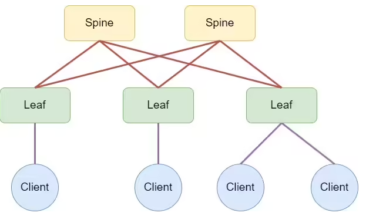

# Планирование адресного пространства для Фабрики. IPv4

#### Цель:
В данной самостоятельной работе необходимо распланировать адресное пространство. 
Настроить IP на всех активных портах для дальнейшей работы над проектом. 
Адресное пространство должно быть задокументировано. 

### Принципы назначения IP адресов

### Выдача IPv4 адресов 

Принципы выделения IPv4-адресов:
- для организации внутренней связности выдаем адреса из приватной сети `10.0.0.0/8`
- Management адреса коммутаторов в будущем будем брать из `172.16.0.0/12`
- Адреса имеют вид `10.MN.T.x/y`. где:
  - Первый октет фиксирован и равен `10`.
  - `y` - определяет длину префикса
  - Второй октет состоит из двух частей `MN`, `M`=номер DC (ЦОД),  `N`=номер POD
  - `T` -определяет тип IP адреса (type)
        `T` может принимать значение:
        - Type=1        -адреса loopback1
        - Type=2        -адреса loopback2
        - Type=3        -адреса PtP соединений SPINE и LEAF
        - Type=4        -адреса PtP соединений LEAF с L3 клиентами
        - Type=5-7      -cервисы
        - Type=8-255     - SVI интерфейсы
  - `x` - определяет адрес устройства

Например: 10.11.2.4/32  - IP адрес loopback2 интерфейса устройства dc01_pod01_leaf02#

Условие выбора - отсутствие конфликтов с другими IP.

## Таблицы IP адресов

|ЦОД№ |POD|#SPINE |Тип адреса|Hostname устройства|Устройство/Устройства|имя интерфейса|IP адрес     |
|----|----|-------|----------|-------------------|---------------------|--------------|-------------|
|DC#1|POD1|SPINE01|loopback  |dc01-pod01-spine01#|SPINE01              |loopback 1    |10.11.1.1/32 |
|DC#1|POD1|SPINE02|loopback  |dc01-pod01-spine02#|SPINE02              |loopback 1    |10.11.1.2/32 |
|DC#1|POD1|LEAF01 |loopback  |dc01-pod01-leaf01# |LEAF01               |loopback 1    |10.11.1.3/32 |
|DC#1|POD1|LEAF02 |loopback  |dc01-pod01-leaf02# |LEAF02               |loopback 1    |10.11.1.4/32 |
|DC#1|POD1|LEAF03 |loopback  |dc01-pod01-leaf03# |LEAF03               |loopback 1    |10.11.1.5/32 |
|DC#1|POD1|резерв |резерв    |резерв             |резерв               |loopback 1    |10.11.1.0/26 |
|DC#1|POD1|SPINE01|loopback  |dc01-pod01-spine01#|SPINE01              |loopback 2    |10.11.2.1/32 |
|DC#1|POD1|SPINE02|loopback  |dc01-pod01-spine02#|SPINE02              |loopback 2    |10.11.2.2/32 |
|DC#1|POD1|LEAF01 |loopback  |dc01-pod01-leaf01# |LEAF01               |loopback 2    |10.11.2.3/32 |
|DC#1|POD1|LEAF02 |loopback  |dc01-pod01-leaf02# |LEAF02               |loopback 2    |10.11.2.4/32 |
|DC#1|POD1|LEAF03 |loopback  |dc01-pod01-leaf03# |LEAF03               |loopback 2    |10.11.2.5/32 |
|DC#1|POD1|резерв |резерв    |резерв             |резерв               |loopback 2    |10.11.2.0/26 |
|DC#1|POD1|SPINE01|PtP_link  |dc01-pod01-spine01#|SPINE01->LEAF01      |eth 1         |10.11.3.0/31 |
|DC#1|POD1|SPINE01|PtP_link  |dc01-pod01-spine01#|SPINE01->LEAF02      |eth 2         |10.11.3.2/31 |
|DC#1|POD1|SPINE01|PtP_link  |dc01-pod01-spine01#|SPINE01->LEAF03      |eth 3         |10.11.3.4/31 |
|DC#1|POD1|SPINE01|PtP_link  |dc01-pod01-spine01#|SPINE01->LEAF04      |eth 4         |10.11.3.6/31 |
|DC#1|POD1|SPINE02|PtP_link  |dc01-pod01-spine02#|SPINE02->LEAF01      |eth 1         |10.11.3.8/31 |
|DC#1|POD1|SPINE02|PtP_link  |dc01-pod01-spine02#|SPINE02->LEAF02      |eth 2         |10.11.3.10/31|
|DC#1|POD1|SPINE02|PtP_link  |dc01-pod01-spine02#|SPINE02->LEAF03      |eth 3         |10.11.3.12/31|
|DC#1|POD1|SPINE02|PtP_link  |dc01-pod01-spine02#|SPINE02->LEAF04      |eth 4         |10.11.3.14/31|
|DC#1|POD1|       |PtP_link  |dc01-pod01-leaf01# |LEAF01->SPINE01      |eth 1         |10.11.3.1/31 |
|DC#1|POD1|       |PtP_link  |dc01-pod01-leaf02# |LEAF02->SPINE01      |eth 1         |10.11.3.3/31 |
|DC#1|POD1|       |PtP_link  |dc01-pod01-leaf03# |LEAF03->SPINE01      |eth 1         |10.11.3.5/31 |
|DC#1|POD1|       |PtP_link  |dc01-pod01-leaf03# |LEAF04->SPINE01      |eth 1         |10.11.3.7/31 |
|DC#1|POD1|       |PtP_link  |dc01-pod01-leaf01# |LEAF01->SPINE02      |eth 2         |10.11.3.9/31 |
|DC#1|POD1|       |PtP_link  |dc01-pod01-leaf02# |LEAF02->SPINE02      |eth 2         |10.11.3.11/31|
|DC#1|POD1|       |PtP_link  |dc01-pod01-leaf03# |LEAF03->SPINE02      |eth 2         |10.11.3.13/31|
|DC#1|POD1|       |PtP_link  |dc01-pod01-leaf03# |LEAF04->SPINE02      |eth 2         |10.11.3.15/31|
|DC#1|POD1|       |PtP_link  |dc01-pod01-leaf01# |LEAF01->CLIENT01     |te0/1         |10.11.4.1/30 |
|DC#1|POD1|       |PtP_link  |dc01-pod01-leaf02# |LEAF02->CLIENT02     |te0/1         |10.11.4.5/30 |
|DC#1|POD1|       |PtP_link  |dc01-pod01-leaf03# |LEAF03->CLIENT03     |te0/1         |10.11.4.9/30 |
|DC#1|POD1|       |PtP_link  |dc01-pod01-leaf03# |LEAF03->CLIENT04     |te0/2         |10.11.4.13/30|

## Итоговая схема

#### Полезные ссылки:
- [RFC1918. Про выделение IPv4-адресов для приватных сетей](https://datatracker.ietf.org/doc/html/rfc1918)
- [RFC3021. Using 31-bit prefixes on IPv4 PTP Links](https://datatracker.ietf.org/doc/html/rfc3021). Сокращение кол-ва используемых IP.
- [RFC3849. Про использование 2001:DB8::/32 для документации](https://datatracker.ietf.org/doc/html/rfc3849)
- [Вдохновение можно поискать в СДСМ](https://linkmeup.ru/blog/1188/). Примеры L1, L2, L3 документации.
- [хороший конвертер Markdown в CSV](https://tableconvert.com/markdown-to-csv) 
- [хороший конвертер CSV в Markdown](https://www.convertcsv.com/csv-to-markdown.htm)

