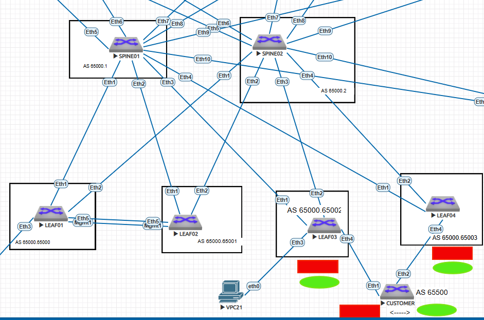

# VxLAN Routing.

### Цель:
Реализовать маршрутизацию между "клиентами" через EVPN route-type 5 <br>
Подключить внешний маршрутизатор <br>
Организовать на нем передачу маршрутов между клиентами в VRF GREEN и  RED <br>

### Принципы назначения IP адресов, адресное пространство
Описаны в документе: [README.md](README.md)

### Итоговая схема


## Конфигурации устройств:

<details>
  <summary> SPINE01 </summary>

```
dc01-pod01-spine01#show running-config
! Command: show running-config
! device: dc01-pod01-spine01 (vEOS-lab, EOS-4.29.2F)
!
! boot system flash:/vEOS-lab.swi
!
no aaa root
!
username Denis secret sha512 $6$y4fXjrcDJ1eVI4aJ$JCiZRs.t0Kx0f3BRqUioTguW5BhatcFeAsKQQkUQaOWS7LWhHXRRKGyeSLP8xF/aU3LOubedln.MaGkP91arx.
!
transceiver qsfp default-mode 4x10G
!
service routing protocols model multi-agent
!
hostname dc01-pod01-spine01
!
spanning-tree mode mstp
!
interface Ethernet1
   description =LINK-TO_LEAF01=
   no switchport
   ip address 10.11.3.0/31
   bfd interval 700 min-rx 500 multiplier 3
   no ip ospf neighbor bfd
   no isis bfd
!
interface Ethernet2
   description =LINK-TO_LEAF02=
   no switchport
   ip address 10.11.3.2/31
   bfd interval 700 min-rx 500 multiplier 3
   no ip ospf neighbor bfd
   no isis bfd
!
interface Ethernet3
   description =LINK_TO_LEAF03=
   no switchport
   ip address 10.11.3.4/31
   bfd interval 700 min-rx 500 multiplier 3
   no ip ospf neighbor bfd
   no isis bfd
!
interface Ethernet4
   description =LINK-TO_LEAF04=
   no switchport
   ip address 10.11.3.6/31
   bfd interval 700 min-rx 500 multiplier 3
   no ip ospf neighbor bfd
   no isis bfd
!
interface Ethernet5
   description =LINK-TO_SLEAF01=
   no switchport
   ip address 10.11.3.8/31
   bfd interval 700 min-rx 500 multiplier 3
   no ip ospf neighbor bfd
   no isis bfd
!
interface Ethernet6
   description =LINK-TO_SLEAF02=
   no switchport
   ip address 10.11.3.10/31
   bfd interval 700 min-rx 500 multiplier 3
   no ip ospf neighbor bfd
   no isis bfd
!
interface Ethernet7
   description =LINK-TO_BLEAF01=
   no switchport
   ip address 10.11.3.12/31
   bfd interval 700 min-rx 500 multiplier 3
   no ip ospf neighbor bfd
   no isis bfd
!
interface Ethernet8
   description =LINK_TO_BLEAF02=
   no switchport
   ip address 10.11.3.14/31
   bfd interval 700 min-rx 500 multiplier 3
   no ip ospf neighbor bfd
   no isis bfd
!
interface Ethernet9
   description =LINK-TO_BGW01=
   no switchport
   ip address 10.11.3.16/31
   bfd interval 700 min-rx 500 multiplier 3
   no ip ospf neighbor bfd
   no isis bfd
!
interface Ethernet10
   description =LINK_TO_BGW02=
   no switchport
   ip address 10.11.3.18/31
   bfd interval 700 min-rx 500 multiplier 3
   no ip ospf neighbor bfd
   no isis bfd
!
interface Ethernet11
!
interface Loopback1
   ip address 10.11.1.1/32
!
interface Loopback2
   ip address 10.11.2.1/32
!
interface Management1
!
ip routing
!
ip prefix-list PL_1
   seq 10 permit 10.11.1.0/24 le 32
   seq 20 permit 10.11.3.0/24 le 32
!
route-map MAP_1 permit 10
   match ip address prefix-list PL_1
!
router bgp 4259840001
   router-id 10.11.1.1
   graceful-restart restart-time 300
   maximum-paths 4 ecmp 64
   neighbor OVERLAY peer group
   neighbor OVERLAY next-hop-unchanged
   neighbor OVERLAY update-source Loopback1
   neighbor OVERLAY ebgp-multihop 3
   neighbor OVERLAY send-community extended
   neighbor 10.11.1.3 peer group OVERLAY
   neighbor 10.11.1.3 remote-as 4259905000
   neighbor 10.11.1.3 description LEAF01_Lo1
   neighbor 10.11.1.3 ebgp-multihop
   neighbor 10.11.1.4 peer group OVERLAY
   neighbor 10.11.1.4 remote-as 4259905001
   neighbor 10.11.1.4 description LEAF02_Lo1
   neighbor 10.11.1.5 peer group OVERLAY
   neighbor 10.11.1.5 remote-as 4259905002
   neighbor 10.11.1.5 description LEAF03_Lo1
   neighbor 10.11.1.6 peer group OVERLAY
   neighbor 10.11.1.6 remote-as 4259905003
   neighbor 10.11.1.6 description LEAF04_Lo1
   neighbor 10.11.1.7 peer group OVERLAY
   neighbor 10.11.1.7 remote-as 4259905101
   neighbor 10.11.1.7 description SLEAF01_Lo1
   neighbor 10.11.1.8 peer group OVERLAY
   neighbor 10.11.1.8 remote-as 4259905102
   neighbor 10.11.1.8 description SLEAF02_Lo1
   neighbor 10.11.1.9 peer group OVERLAY
   neighbor 10.11.1.9 remote-as 4259905201
   neighbor 10.11.1.9 description BLEAF01_Lo1
   neighbor 10.11.1.10 peer group OVERLAY
   neighbor 10.11.1.10 remote-as 4259905202
   neighbor 10.11.1.10 description BLEAF02_Lo1
   neighbor 10.11.1.11 peer group OVERLAY
   neighbor 10.11.1.11 remote-as 4259905301
   neighbor 10.11.1.11 description BGW01_Lo1
   neighbor 10.11.1.12 peer group OVERLAY
   neighbor 10.11.1.12 remote-as 4259905302
   neighbor 10.11.1.12 description BGW02_Lo1
   neighbor 10.11.3.1 remote-as 4259905000
   neighbor 10.11.3.1 bfd
   neighbor 10.11.3.1 description LEAF01
   neighbor 10.11.3.1 route-map MAP_1 in
   neighbor 10.11.3.1 password 7 m3FjC6w2d6o=
   neighbor 10.11.3.3 remote-as 4259905001
   neighbor 10.11.3.3 bfd
   neighbor 10.11.3.3 description LEAF02
   neighbor 10.11.3.3 route-map MAP_1 in
   neighbor 10.11.3.3 password 7 kZcBlBo8kLo=
   neighbor 10.11.3.5 remote-as 4259905002
   neighbor 10.11.3.5 bfd
   neighbor 10.11.3.5 description LEAF03
   neighbor 10.11.3.5 route-map MAP_1 in
   neighbor 10.11.3.5 password 7 kGZWqyCmNl4=
   neighbor 10.11.3.7 remote-as 4259905003
   neighbor 10.11.3.7 bfd
   neighbor 10.11.3.7 description LEAF04
   neighbor 10.11.3.7 route-map MAP_1 in
   neighbor 10.11.3.7 password 7 JVIkOCtPnDM=
   neighbor 10.11.3.9 remote-as 4259905101
   neighbor 10.11.3.9 bfd
   neighbor 10.11.3.9 description SLEAF01
   neighbor 10.11.3.9 route-map MAP_1 in
   neighbor 10.11.3.9 password 7 mGBWW5zgOEE=
   neighbor 10.11.3.11 remote-as 4259905102
   neighbor 10.11.3.11 bfd
   neighbor 10.11.3.11 description SLEAF02
   neighbor 10.11.3.11 route-map MAP_1 in
   neighbor 10.11.3.11 password 7 jSSRC/e2y7E=
   neighbor 10.11.3.13 remote-as 4259905201
   neighbor 10.11.3.13 bfd
   neighbor 10.11.3.13 description BLEAF01
   neighbor 10.11.3.13 route-map MAP_1 in
   neighbor 10.11.3.13 password 7 IVk4JXzOQBg=
   neighbor 10.11.3.15 remote-as 4259905202
   neighbor 10.11.3.15 bfd
   neighbor 10.11.3.15 description BLEAF02
   neighbor 10.11.3.15 route-map MAP_1 in
   neighbor 10.11.3.15 password 7 7aYBVA/JiU8=
   neighbor 10.11.3.17 remote-as 4259905301
   neighbor 10.11.3.17 bfd
   neighbor 10.11.3.17 description BGW01
   neighbor 10.11.3.17 route-map MAP_1 in
   neighbor 10.11.3.17 password 7 e01wILS8YqY=
   neighbor 10.11.3.19 remote-as 4259905302
   neighbor 10.11.3.19 bfd
   neighbor 10.11.3.19 description BGW02
   neighbor 10.11.3.19 route-map MAP_1 in
   neighbor 10.11.3.19 password 7 hBf7gSNWhXU=
   !
   address-family evpn
      neighbor OVERLAY activate
   !
   address-family ipv4
      network 10.11.1.1/32
      network 10.11.3.0/24
      graceful-restart
!
end

```
</details> 

<details>
  <summary>SPINE02 </summary>

```
dc01-pod01-spine02#show running-config
! Command: show running-config
! device: dc01-pod01-spine02 (vEOS-lab, EOS-4.29.2F)
!
! boot system flash:/vEOS-lab.swi
!
no aaa root
!
transceiver qsfp default-mode 4x10G
!
service routing protocols model multi-agent
!
hostname dc01-pod01-spine02
!
spanning-tree mode mstp
!
interface Ethernet1
   description =LINK-TO_LEAF01=
   no switchport
   ip address 10.11.3.40/31
   bfd interval 700 min-rx 500 multiplier 3
   no ip ospf neighbor bfd
   no isis bfd
!
interface Ethernet2
   description =LINK_TO_LEAF02=
   no switchport
   ip address 10.11.3.42/31
   bfd interval 700 min-rx 500 multiplier 3
   no ip ospf neighbor bfd
   no isis bfd
!
interface Ethernet3
   description =LINK_TO_LEAF03=
   no switchport
   ip address 10.11.3.44/31
   bfd interval 700 min-rx 500 multiplier 3
   no ip ospf neighbor bfd
   no isis bfd
!
interface Ethernet4
   description =LINK_TO_LEAF04=
   no switchport
   ip address 10.11.3.46/31
   bfd interval 700 min-rx 500 multiplier 3
   no ip ospf neighbor bfd
   no isis bfd
!
interface Ethernet5
   description =LINK_TO_SLEAF01=
   no switchport
   ip address 10.11.3.48/31
   bfd interval 700 min-rx 500 multiplier 3
   no ip ospf neighbor bfd
   no isis bfd
!
interface Ethernet6
   description =LINK_TO_SLEAF02=
   no switchport
   ip address 10.11.3.50/31
   bfd interval 700 min-rx 500 multiplier 3
   no ip ospf neighbor bfd
   no isis bfd
!
interface Ethernet7
   description =LINK_TO_BLEAF01=
   no switchport
   ip address 10.11.3.52/31
   bfd interval 700 min-rx 500 multiplier 3
   no ip ospf neighbor bfd
   no isis bfd
!
interface Ethernet8
   description =LINK_TO_BLEAF02=
   no switchport
   ip address 10.11.3.54/31
   bfd interval 700 min-rx 500 multiplier 3
   no ip ospf neighbor bfd
   no isis bfd
!
interface Ethernet9
   description =LINK_TO_BGW01=
   no switchport
   ip address 10.11.3.56/31
   bfd interval 700 min-rx 500 multiplier 3
   no ip ospf neighbor bfd
   no isis bfd
!
interface Ethernet10
   description =LINK_TO_BGW02=
   no switchport
   ip address 10.11.3.58/31
   bfd interval 700 min-rx 500 multiplier 3
   no ip ospf neighbor bfd
   no isis bfd
!
interface Ethernet11
!
interface Loopback1
   ip address 10.11.1.2/32
!
interface Management1
!
ip routing
!
ip prefix-list PL_1
   seq 10 permit 10.11.1.0/24 le 32
   seq 20 permit 10.11.3.0/24 le 32
!
route-map MAP_1 permit 10
   match ip address prefix-list PL_1
!
router bgp 4259840002
   router-id 10.11.1.2
   graceful-restart restart-time 300
   maximum-paths 4 ecmp 64
   neighbor OVERLAY peer group
   neighbor OVERLAY next-hop-unchanged
   neighbor OVERLAY update-source Loopback1
   neighbor OVERLAY ebgp-multihop 3
   neighbor OVERLAY send-community extended
   neighbor 10.11.1.3 peer group OVERLAY
   neighbor 10.11.1.3 remote-as 4259905000
   neighbor 10.11.1.3 description LEAF01_Lo1
   neighbor 10.11.1.3 ebgp-multihop 2
   neighbor 10.11.1.4 peer group OVERLAY
   neighbor 10.11.1.4 remote-as 4259905001
   neighbor 10.11.1.4 description LEAF02_Lo1
   neighbor 10.11.1.5 peer group OVERLAY
   neighbor 10.11.1.5 remote-as 4259905002
   neighbor 10.11.1.5 description LEAF03_Lo1
   neighbor 10.11.1.6 peer group OVERLAY
   neighbor 10.11.1.6 remote-as 4259905003
   neighbor 10.11.1.6 description LEAF04_Lo1
   neighbor 10.11.1.7 peer group OVERLAY
   neighbor 10.11.1.7 remote-as 4259905101
   neighbor 10.11.1.7 description SLEAF01_Lo1
   neighbor 10.11.1.8 peer group OVERLAY
   neighbor 10.11.1.8 remote-as 4259905102
   neighbor 10.11.1.8 description SLEAF02_Lo1
   neighbor 10.11.1.9 peer group OVERLAY
   neighbor 10.11.1.9 remote-as 4259905201
   neighbor 10.11.1.9 description BLEAF01_Lo1
   neighbor 10.11.1.10 peer group OVERLAY
   neighbor 10.11.1.10 remote-as 4259905202
   neighbor 10.11.1.10 description BLEAF02_Lo1
   neighbor 10.11.1.11 peer group OVERLAY
   neighbor 10.11.1.11 remote-as 4259905301
   neighbor 10.11.1.11 description BGW01_Lo1
   neighbor 10.11.1.12 peer group OVERLAY
   neighbor 10.11.1.12 remote-as 4259905302
   neighbor 10.11.1.12 description BGW02_Lo1
   neighbor 10.11.3.41 remote-as 4259905000
   neighbor 10.11.3.41 bfd
   neighbor 10.11.3.41 description LEAF01
   neighbor 10.11.3.41 route-map MAP_1 in
   neighbor 10.11.3.41 password 7 X1D+FhPL62M=
   neighbor 10.11.3.43 remote-as 4259905001
   neighbor 10.11.3.43 bfd
   neighbor 10.11.3.43 description LEAF02
   neighbor 10.11.3.43 route-map MAP_1 in
   neighbor 10.11.3.43 password 7 v+YQEIAfTLQ=
   neighbor 10.11.3.45 remote-as 4259905002
   neighbor 10.11.3.45 bfd
   neighbor 10.11.3.45 description LEAF03
   neighbor 10.11.3.45 route-map MAP_1 in
   neighbor 10.11.3.45 password 7 48bUQaGsEyA=
   neighbor 10.11.3.47 remote-as 4259905003
   neighbor 10.11.3.47 bfd
   neighbor 10.11.3.47 description LEAF04
   neighbor 10.11.3.47 route-map MAP_1 in
   neighbor 10.11.3.47 password 7 2L3nuAWmD7Y=
   neighbor 10.11.3.49 remote-as 4259905101
   neighbor 10.11.3.49 bfd
   neighbor 10.11.3.49 description SLEAF01
   neighbor 10.11.3.49 route-map MAP_1 in
   neighbor 10.11.3.49 password 7 69qWpBfLKT0=
   neighbor 10.11.3.51 remote-as 4259905102
   neighbor 10.11.3.51 bfd
   neighbor 10.11.3.51 description SLEAF02
   neighbor 10.11.3.51 route-map MAP_1 in
   neighbor 10.11.3.51 password 7 X1D+FhPL62M=
   neighbor 10.11.3.53 remote-as 4259905201
   neighbor 10.11.3.53 bfd
   neighbor 10.11.3.53 description BLEAF01
   neighbor 10.11.3.53 route-map MAP_1 in
   neighbor 10.11.3.53 password 7 v+YQEIAfTLQ=
   neighbor 10.11.3.55 remote-as 4259905202
   neighbor 10.11.3.55 bfd
   neighbor 10.11.3.55 description BLEAF02
   neighbor 10.11.3.55 route-map MAP_1 in
   neighbor 10.11.3.55 password 7 48bUQaGsEyA=
   neighbor 10.11.3.57 remote-as 4259905301
   neighbor 10.11.3.57 bfd
   neighbor 10.11.3.57 description BGW01
   neighbor 10.11.3.57 route-map MAP_1 in
   neighbor 10.11.3.57 password 7 2L3nuAWmD7Y=
   neighbor 10.11.3.59 remote-as 4259905302
   neighbor 10.11.3.59 bfd
   neighbor 10.11.3.59 description BGW02
   neighbor 10.11.3.59 route-map MAP_1 in
   neighbor 10.11.3.59 password 7 69qWpBfLKT0=
   !
   address-family evpn
      neighbor OVERLAY activate
   !
   address-family ipv4
      neighbor 10.11.3.41 activate
      neighbor 10.11.3.43 activate
      neighbor 10.11.3.45 activate
      neighbor 10.11.3.47 activate
      neighbor 10.11.3.49 activate
      neighbor 10.11.3.51 activate
      neighbor 10.11.3.53 activate
      neighbor 10.11.3.55 activate
      neighbor 10.11.3.57 activate
      neighbor 10.11.3.59 activate
      network 10.11.1.2/32
      network 10.11.3.0/24
      graceful-restart
!
end
dc01-pod01-spine02#
```
</details> 

<details>
  <summary>LEAF01 </summary>

```
dc01-pod01-leaf01#show running-config
! Command: show running-config
! device: dc01-pod01-leaf01 (vEOS-lab, EOS-4.29.2F)
!
! boot system flash:/vEOS-lab.swi
!
no aaa root
!
transceiver qsfp default-mode 4x10G
!
service routing protocols model multi-agent
!
logging synchronous level critical
!
hostname dc01-pod01-leaf01
!
spanning-tree mode mstp
no spanning-tree vlan-id 4000-4001
!
vlan 10
   name =VLAN_10_test=
!
vlan 20
   name =VLAN20_Assimetric_IRB=
!
vlan 30
   name =VLAN_30_Symmetric_IRB_SVI_L3VNI
!
vlan 40
   name =VLAN_40_Symmetric_IRB_L3VNI=
!
vlan 201
   name TEST_Connect
   trunk group MLAG_Peer
!
vlan 202
!
vlan 301
   name GREEN
!
vlan 302
   name RED
!
vlan 4000
   name =MLAG_Peer_VLAN=
   trunk group MLAG_Peer
!
vlan 4001
   name -VLAN_LEAF-to_LEAF
   trunk group MLAG_Peer
!
vrf instance CUSTOMER_L3VNI
!
vrf instance GREEN
!
vrf instance RED
!
interface Port-Channel4000
   description =MLAG_Peer=
   switchport mode trunk
   switchport trunk group MLAG_Peer
   spanning-tree link-type point-to-point
!
interface Ethernet1
   description =LINK-TO_SPINE01=
   no switchport
   ip address 10.11.3.1/31
   bfd interval 700 min-rx 500 multiplier 3
   no ip ospf neighbor bfd
   no isis bfd
!
interface Ethernet2
   description =LINK-TO_SPINE02=
   no switchport
   ip address 10.11.3.41/31
   bfd interval 700 min-rx 500 multiplier 3
   no ip ospf neighbor bfd
   no isis bfd
!
interface Ethernet3
   description =HOST=
   switchport access vlan 201
!
interface Ethernet4
!
interface Ethernet5
   description =MLAG_peer_link=
   channel-group 4000 mode active
!
interface Ethernet6
!
interface Ethernet7
!
interface Ethernet8
!
interface Loopback1
   ip address 10.11.1.3/32
!
interface Loopback2
   ip address 10.11.2.3/32
!
interface Management1
   ip address 172.16.0.1/24
!
interface Vlan10
   ip address 10.88.88.2/24
   ip virtual-router address 10.88.88.1/24
!
interface Vlan20
   ip address 10.10.10.2/24
   ip virtual-router address 10.10.10.1/24
!
interface Vlan30
   vrf CUSTOMER_L3VNI
   ip address 10.30.30.3/24
   ip virtual-router address 10.30.30.1/24
!
interface Vlan40
   vrf CUSTOMER_L3VNI
   ip address 10.40.40.3/24
   ip virtual-router address 10.40.40.1/24
!
interface Vlan201
   vrf CUSTOMER_L3VNI
   ip address 1.1.1.222/24
   ip virtual-router address 1.1.1.254/24
!
interface Vlan301
   vrf GREEN
   ip address 192.168.1.10/24
   ip virtual-router address 192.168.1.1/24
!
interface Vlan302
   vrf RED
   ip address 192.168.2.10/24
   ip virtual-router address 192.168.2.1/24
!
interface Vlan4000
   no autostate
   ip address 10.40.0.254/31
!
interface Vlan4001
   mtu 9214
   ip address 10.0.3.0/31
!
interface Vxlan1
   description =VXLAN=
   vxlan source-interface Loopback2
   vxlan udp-port 4789
   vxlan vlan 10 vni 100010
   vxlan vlan 20 vni 100020
   vxlan vlan 30 vni 100030
   vxlan vlan 40 vni 100040
   vxlan vlan 201 vni 100201
   vxlan vlan 301 vni 1000301
   vxlan vlan 302 vni 1000302
   vxlan vrf CUSTOMER_L3VNI vni 1000777
   vxlan vrf GREEN vni 1000888
   vxlan vrf RED vni 1000999
   vxlan learn-restrict any
!
ip virtual-router mac-address ba:be:fa:ce:fa:de
!
ip routing
ip routing vrf CUSTOMER_L3VNI
ip routing vrf GREEN
ip routing vrf RED
!
ip prefix-list PL_1
   seq 10 permit 10.11.1.0/24 le 32
   seq 20 permit 10.11.3.0/24 le 32
!
mlag configuration
   domain-id LEAF01-02
   local-interface Vlan4000
   peer-address 10.40.0.255
   peer-address heartbeat 172.16.0.2 vrf mgmt
   peer-link Port-Channel4000
   dual-primary detection delay 10 action errdisable all-interfaces
!
route-map MAP_1 permit 10
   match ip address prefix-list PL_1
!
router bgp 4259905000
   router-id 10.11.1.3
   graceful-restart restart-time 300
   maximum-paths 4 ecmp 64
   neighbor EVPN peer group
   neighbor EVPN remote-as 4259840001
   neighbor EVPN update-source Loopback1
   neighbor EVPN ebgp-multihop 3
   neighbor EVPN send-community extended
   neighbor EVPN2 peer group
   neighbor EVPN2 remote-as 4259840002
   neighbor EVPN2 update-source Loopback1
   neighbor EVPN2 ebgp-multihop 3
   neighbor EVPN2 send-community extended
   neighbor underlay_ibgp peer group
   neighbor underlay_ibgp remote-as 4259905001
   neighbor underlay_ibgp maximum-routes 12000 warning-only
   neighbor 10.0.3.1 peer group underlay_ibgp
   neighbor 10.11.1.1 peer group EVPN
   neighbor 10.11.1.1 description SPINE01_Lo1
   neighbor 10.11.1.2 peer group EVPN2
   neighbor 10.11.1.2 description SPINE02_Lo1
   neighbor 10.11.3.0 remote-as 4259840001
   neighbor 10.11.3.0 bfd
   neighbor 10.11.3.0 description SPINE01
   neighbor 10.11.3.0 route-map MAP_1 in
   neighbor 10.11.3.0 password 7 m3FjC6w2d6o=
   neighbor 10.11.3.40 remote-as 4259840002
   neighbor 10.11.3.40 bfd
   neighbor 10.11.3.40 description SPINE02
   neighbor 10.11.3.40 route-map MAP_1 in
   neighbor 10.11.3.40 password 7 X1D+FhPL62M=
   !
   vlan 10
      rd auto
      route-target both 65001:65001
      redistribute learned
      redistribute static
   !
   vlan 20
      rd auto
      route-target both 65001:65001
      redistribute learned
      redistribute static
   !
   vlan 201
      rd 0.0.0.1:1
      route-target both 100:100
      redistribute learned
      redistribute static
   !
   vlan 30
      rd 65001:100030
      route-target both 65001:30
      redistribute learned
      redistribute static
   !
   vlan 301
      rd 65001:1000301
      route-target both 301:301
   !
   vlan 302
      rd 65001:1000302
      route-target both 302:302
   !
   vlan 40
      rd 65001:100040
      route-target both 65001:40
      redistribute learned
      redistribute static
   !
   address-family evpn
      neighbor EVPN activate
      neighbor EVPN2 activate
   !
   address-family ipv4
      network 10.11.1.3/32
      network 10.11.2.3/32
      network 10.11.3.0/31
      network 10.11.3.40/31
      graceful-restart
   !
   vrf CUSTOMER_L3VNI
      rd 10.11.1.4:1
      route-target import evpn 65000:1
      route-target export evpn 65000:1
      redistribute connected
   !
   vrf GREEN
      rd 1000888:888
      route-target import evpn 301:1000888
      route-target export evpn 301:1000888
   !
   vrf RED
      rd 1000999:999
      route-target import evpn 302:1000999
      route-target export evpn 302:1000999
!
end
dc01-pod01-leaf01#
```
</details> 

<details>
  <summary>LEAF02 </summary>

```
dc01-pod01-leaf02#show running-config
! Command: show running-config
! device: dc01-pod01-leaf02 (vEOS-lab, EOS-4.29.2F)
!
! boot system flash:/vEOS-lab.swi
!
no aaa root
!
transceiver qsfp default-mode 4x10G
!
service routing protocols model multi-agent
!
logging synchronous level critical
!
hostname dc01-pod01-leaf02
!
spanning-tree mode mstp
no spanning-tree vlan-id 4000-4001
!
vlan 10
   name -=VLAN_10=-
!
vlan 20
!
vlan 30
   name =VLAN_30_Symmetric_IRB_SVI_L3VNI
!
vlan 40
   name =VLAN_40_Symmetric_IRB_L3VNI=
!
vlan 4000
   name =MLAG_Peer_VLAN=
   trunk group MLAG_Peer
!
vlan 4001
   name =VLAN_LEAF_to_Leaf
   trunk group MLAG_Peer
   trunk group mlag-peer
!
vrf instance CUSTOMER_L3VNI
!
interface Port-Channel4000
   description =MLAG_Peer=
   switchport mode trunk
   switchport trunk group MLAG_Peer
   spanning-tree link-type point-to-point
!
interface Ethernet1
   description =LINK_TO_SPINE01=
   no switchport
   ip address 10.11.3.3/31
   bfd interval 700 min-rx 500 multiplier 3
   no ip ospf neighbor bfd
   no isis bfd
!
interface Ethernet2
   description =LINK_TO_SPINE02=
   no switchport
   ip address 10.11.3.43/31
   bfd interval 700 min-rx 500 multiplier 3
   no ip ospf neighbor bfd
   no isis bfd
!
interface Ethernet3
!
interface Ethernet4
!
interface Ethernet5
   description =MLAG_peer_link=
   channel-group 4000 mode active
!
interface Ethernet6
!
interface Ethernet7
!
interface Ethernet8
!
interface Loopback1
   ip address 10.11.1.4/32
!
interface Loopback2
   ip address 10.11.2.3/32
!
interface Management1
   ip address 172.16.0.2/24
!
interface Vlan10
   ip virtual-router address 10.88.88.1/24
!
interface Vlan20
   ip address 10.10.10.3/24
   ip virtual-router address 10.10.10.1/24
!
interface Vlan30
   vrf CUSTOMER_L3VNI
   ip address 10.30.30.2/24
   ip virtual-router address 10.30.30.1/24
!
interface Vlan40
   vrf CUSTOMER_L3VNI
   ip address 10.40.40.2/24
   ip virtual-router address 10.40.40.1/24
!
interface Vlan4000
   ip address 10.40.0.255/31
!
interface Vlan4001
   mtu 9214
   ip address 10.0.3.1/31
!
interface Vxlan1
   description =VXLAN=
   vxlan source-interface Loopback2
   vxlan udp-port 4789
   vxlan vlan 10 vni 100010
   vxlan vlan 20 vni 100020
   vxlan vlan 30 vni 100030
   vxlan vlan 40 vni 100040
   vxlan vrf CUSTOMER_L3VNI vni 1000777
   vxlan learn-restrict any
!
ip virtual-router mac-address ba:be:fa:ce:fa:de
!
ip routing
ip routing vrf CUSTOMER_L3VNI
!
ip prefix-list PL_1
   seq 10 permit 10.11.1.0/24 le 32
   seq 20 permit 10.11.3.0/24 le 32
!
mlag configuration
   domain-id LEAF01-02
   local-interface Vlan4000
   peer-address 10.40.0.254
   peer-address heartbeat 172.16.0.1 vrf mgmt
   peer-link Port-Channel4000
   dual-primary detection delay 10 action errdisable all-interfaces
!
route-map MAP_1 permit 10
   match ip address prefix-list PL_1
!
router bgp 4259905001
   router-id 10.11.1.4
   graceful-restart restart-time 300
   maximum-paths 4 ecmp 64
   neighbor EVPN peer group
   neighbor EVPN remote-as 4259840001
   neighbor EVPN update-source Loopback1
   neighbor EVPN ebgp-multihop 3
   neighbor EVPN send-community extended
   neighbor EVPN2 peer group
   neighbor EVPN2 remote-as 4259840002
   neighbor EVPN2 update-source Loopback1
   neighbor EVPN2 ebgp-multihop 3
   neighbor EVPN2 send-community extended
   neighbor underlay_ibgp peer group
   neighbor underlay_ibgp remote-as 4259905000
   neighbor underlay_ibgp maximum-routes 12000 warning-only
   neighbor 10.0.3.0 peer group underlay_ibgp
   neighbor 10.11.1.1 peer group EVPN
   neighbor 10.11.1.1 description SPINE01_Lo1
   neighbor 10.11.1.2 peer group EVPN2
   neighbor 10.11.1.2 description SPINE02_Lo1
   neighbor 10.11.3.2 remote-as 4259840001
   neighbor 10.11.3.2 bfd
   neighbor 10.11.3.2 description SPINE01
   neighbor 10.11.3.2 route-map MAP_1 in
   neighbor 10.11.3.2 password 7 kZcBlBo8kLo=
   neighbor 10.11.3.42 remote-as 4259840002
   neighbor 10.11.3.42 bfd
   neighbor 10.11.3.42 description SPINE02
   neighbor 10.11.3.42 route-map MAP_1 in
   neighbor 10.11.3.42 password 7 v+YQEIAfTLQ=
   !
   vlan 10
      rd 65001:10010
      route-target both 65001:65001
      redistribute learned
      redistribute static
   !
   vlan 20
      rd auto
      route-target both 65001:65001
      redistribute learned
      redistribute static
   !
   vlan 30
      rd 65001:100030
      route-target both 65001:30
      redistribute learned
      redistribute static
   !
   vlan 40
      rd 65001:100040
      route-target both 65001:40
      redistribute learned
      redistribute static
   !
   address-family evpn
      neighbor EVPN activate
      neighbor EVPN2 activate
   !
   address-family ipv4
      network 10.11.1.4/32
      network 10.11.2.3/32
      network 10.11.3.2/31
      network 10.11.3.42/31
      network 10.11.3.0/24
      graceful-restart
   !
   vrf CUSTOMER_L3VNI
      rd 10.11.1.4:1
      route-target import evpn 65000:1
      route-target export evpn 65000:1
      redistribute connected
!
end
dc01-pod01-leaf02#
```
</details> 

<details>
  <summary> LEAF03 </summary>

```
dc01-pod01-leaf03#show running-config
! Command: show running-config
! device: dc01-pod01-leaf03 (vEOS-lab, EOS-4.29.2F)
!
! boot system flash:/vEOS-lab.swi
!
no aaa root
!
transceiver qsfp default-mode 4x10G
!
service routing protocols model multi-agent
!
logging synchronous level critical
!
hostname dc01-pod01-leaf03
!
spanning-tree mode mstp
!
vlan 10
   name VLAN_10_Test
!
vlan 20
   name =VLAN20__Assimetric_IRB=
!
vlan 201-202
   name =ESI_CUSTOMR
!
vlan 301
   name GREEN
!
vlan 302
   name RED
!
vrf instance CUSTOMER_L3VNI
!
vrf instance GREEN
!
vrf instance RED
!
interface Port-Channel1
   switchport trunk allowed vlan 201-202,301-302
   switchport mode trunk
   !
   evpn ethernet-segment
      identifier 0000:babe:face:fade:bace
      route-target import ba:be:fa:ce:ba:ce
   lacp system-id fade.babe.face
!
interface Ethernet1
   description =LINK_TO_SPINE01=
   mtu 9214
   no switchport
   ip address 10.11.3.5/31
   bfd interval 700 min-rx 500 multiplier 3
   no ip ospf neighbor bfd
   no isis bfd
!
interface Ethernet2
   description =LINK_TO_SPINE02=
   mtu 9214
   no switchport
   ip address 10.11.3.45/31
   bfd interval 700 min-rx 500 multiplier 3
   no ip ospf neighbor bfd
   no isis bfd
!
interface Ethernet3
   description =TEST3=
   mtu 9214
   switchport access vlan 201
!
interface Ethernet4
   description =ESI_LAG=
   mtu 9214
   channel-group 1 mode active
!
interface Ethernet5
   mtu 9214
!
interface Ethernet6
   mtu 9214
!
interface Ethernet7
   mtu 9214
!
interface Ethernet8
   mtu 9214
!
interface Loopback1
   ip address 10.11.1.5/32
!
interface Loopback2
   ip address 10.11.2.5/32
!
interface Management1
!
interface Vlan10
   ip address 10.88.88.3/24
   ip virtual-router address 10.88.88.1/24
!
interface Vlan20
   ip address 10.10.10.3/24
   ip virtual-router address 10.10.10.1/24
!
interface Vlan201
   vrf CUSTOMER_L3VNI
   ip address 1.1.1.2/24
   ip virtual-router address 1.1.1.254/24
!
interface Vlan202
   vrf CUSTOMER_L3VNI
   ip address 2.2.2.3/24
   ip virtual-router address 2.2.2.254/24
!
interface Vlan301
   vrf GREEN
   ip address 192.168.1.39/24
   ip virtual-router address 192.168.1.1/24
!
interface Vlan302
   vrf RED
   ip address 192.168.2.39/24
   ip virtual-router address 192.168.2.1/24
!
interface Vxlan1
   description =VXLAN=
   vxlan source-interface Loopback1
   vxlan udp-port 4789
   vxlan vlan 10 vni 100010
   vxlan vlan 20 vni 100020
   vxlan vlan 201 vni 100201
   vxlan vlan 202 vni 100202
   vxlan vlan 301 vni 1000301
   vxlan vlan 302 vni 1000302
   vxlan vrf CUSTOMER_L3VNI vni 1000777
   vxlan vrf GREEN vni 1000888
   vxlan vrf RED vni 1000999
   vxlan learn-restrict any
!
ip virtual-router mac-address 00:00:00:00:00:10
!
ip routing
ip routing vrf CUSTOMER_L3VNI
ip routing vrf GREEN
ip routing vrf RED
!
ip prefix-list PL_1
   seq 10 permit 10.11.1.0/24 le 32
   seq 20 permit 10.11.3.0/24 le 32
!
route-map MAP_1 permit 10
   match ip address prefix-list PL_1
!
router bgp 4259905002
   router-id 10.11.1.5
   graceful-restart restart-time 300
   maximum-paths 4 ecmp 64
   neighbor EVPN peer group
   neighbor EVPN remote-as 4259840001
   neighbor EVPN update-source Loopback1
   neighbor EVPN ebgp-multihop 3
   neighbor EVPN send-community extended
   neighbor EVPN2 peer group
   neighbor EVPN2 remote-as 4259840002
   neighbor EVPN2 update-source Loopback1
   neighbor EVPN2 ebgp-multihop 3
   neighbor EVPN2 send-community extended
   neighbor 10.11.1.1 peer group EVPN
   neighbor 10.11.1.1 description SPINE01_Lo1
   neighbor 10.11.1.2 peer group EVPN2
   neighbor 10.11.1.2 description SPINE02_Lo1
   neighbor 10.11.3.4 remote-as 4259840001
   neighbor 10.11.3.4 bfd
   neighbor 10.11.3.4 description SPINE01
   neighbor 10.11.3.4 route-map MAP_1 in
   neighbor 10.11.3.4 password 7 kGZWqyCmNl4=
   neighbor 10.11.3.44 remote-as 4259840002
   neighbor 10.11.3.44 bfd
   neighbor 10.11.3.44 description SPINE02
   neighbor 10.11.3.44 route-map MAP_1 in
   neighbor 10.11.3.44 password 7 48bUQaGsEyA=
   !
   vlan 10
      rd auto
      route-target both 65001:65001
      redistribute learned
      redistribute static
   !
   vlan 20
      rd auto
      route-target both 65001:65001
      redistribute learned
      redistribute static
   !
   vlan 201
      rd 0.0.0.1:1
      route-target both 100:100
      redistribute learned
   !
   vlan 202
      rd 0.0.0.2:2
      route-target both 100:100
      redistribute learned
   !
   vlan 301
      rd 65001:1000301
      route-target both 301:301
   !
   vlan 302
      rd 65001:1000302
      route-target both 302:302
   !
   address-family evpn
      neighbor EVPN activate
      neighbor EVPN2 activate
   !
   address-family ipv4
      neighbor 10.11.3.4 activate
      neighbor 10.11.3.44 activate
      network 10.11.1.5/32
      network 10.11.2.5/32
      graceful-restart
   !
   vrf CUSTOMER_L3VNI
      rd 10.11.1.5:1
      route-target import evpn 65000:1
      route-target export evpn 65000:1
      redistribute connected
   !
   vrf GREEN
      rd 1000888:888
      route-target import evpn 301:1000888
      route-target export evpn 301:1000888
      neighbor 192.168.1.200 remote-as 65500
      neighbor 192.168.1.200 description GREEN_VRF-GW
      !
      address-family ipv4
         neighbor 192.168.1.200 activate
   !
   vrf RED
      rd 1000999:999
      route-target import evpn 302:1000999
      route-target export evpn 302:1000999
      neighbor 192.168.2.200 remote-as 65500
      neighbor 192.168.2.200 description RED_VRF-GW
      !
      address-family ipv4
         neighbor 192.168.2.200 activate
!
end
```
</details> 

<details>
  <summary>LEAF04 </summary>

```
dc01-pod01-leaf04#show running-config
! Command: show running-config
! device: dc01-pod01-leaf04 (vEOS-lab, EOS-4.29.2F)
!
! boot system flash:/vEOS-lab.swi
!
no aaa root
!
transceiver qsfp default-mode 4x10G
!
service routing protocols model multi-agent
!
logging synchronous level critical
!
hostname dc01-pod01-leaf04
!
spanning-tree mode mstp
!
vlan 30
   name =VLAN_30_Symmetric_IRB_SVI_L3VNI
!
vlan 40
   name =VLAN_40_Symmetric_IRB_L3VNI=
!
vlan 201-202
   name =LAG_Customer=
!
vlan 301
   name GREEN
!
vlan 302
   name RED
!
vlan 501-502
!
vrf instance CUSTOMER_L3VNI
!
vrf instance GREEN
!
vrf instance RED
!
interface Port-Channel1
   switchport trunk allowed vlan 201-202,301-302
   switchport mode trunk
   !
   evpn ethernet-segment
      identifier 0000:babe:face:fade:bace
      route-target import ba:be:fa:ce:ba:ce
   lacp system-id fade.babe.face
!
interface Ethernet1
   description =LINK_TO_SPINE01=
   mtu 9214
   no switchport
   ip address 10.11.3.7/31
   bfd interval 700 min-rx 500 multiplier 3
   no ip ospf neighbor bfd
   no isis bfd
!
interface Ethernet2
   description =LINK_TO_SPINE02=
   mtu 9214
   no switchport
   ip address 10.11.3.47/31
   bfd interval 700 min-rx 500 multiplier 3
   no ip ospf neighbor bfd
   no isis bfd
!
interface Ethernet3
   mtu 9214
   switchport access vlan 30
!
interface Ethernet4
   description =ESI_LAG=
   mtu 9214
   channel-group 1 mode active
!
interface Ethernet5
   mtu 9214
!
interface Ethernet6
   mtu 9214
!
interface Ethernet7
   mtu 9214
!
interface Ethernet8
   mtu 9214
!
interface Loopback1
   ip address 10.11.1.6/32
!
interface Management1
!
interface Vlan30
   vrf CUSTOMER_L3VNI
   ip address 10.30.30.4/24
   ip virtual-router address 10.30.30.1/24
!
interface Vlan40
   vrf CUSTOMER_L3VNI
   ip address 10.40.40.4/24
   ip virtual-router address 10.40.40.1/24
!
interface Vlan201
   vrf CUSTOMER_L3VNI
   ip address 1.1.1.3/24
   ip virtual-router address 1.1.1.254/24
!
interface Vlan202
   vrf CUSTOMER_L3VNI
   ip address 2.2.2.1/24
   ip virtual-router address 2.2.2.254/24
!
interface Vlan301
   vrf GREEN
   ip address 192.168.1.40/24
   ip virtual-router address 192.168.1.1/24
!
interface Vlan302
   vrf RED
   ip address 192.168.2.40/24
   ip virtual-router address 192.168.2.1/24
!
interface Vlan501
   vrf GREEN
   ip address 192.168.22.40/24
!
interface Vlan502
   vrf RED
   ip address 192.168.23.40/24
!
interface Vxlan1
   description =VXLAN=
   vxlan source-interface Loopback1
   vxlan udp-port 4789
   vxlan vlan 10 vni 100010
   vxlan vlan 30 vni 100030
   vxlan vlan 40 vni 100040
   vxlan vlan 201 vni 100201
   vxlan vlan 202 vni 100202
   vxlan vlan 301 vni 1000301
   vxlan vlan 302 vni 1000302
   vxlan vrf CUSTOMER_L3VNI vni 1000777
   vxlan vrf GREEN vni 1000888
   vxlan vrf RED vni 1000999
   vxlan learn-restrict any
!
ip virtual-router mac-address 00:00:00:00:00:10
!
ip routing
ip routing vrf CUSTOMER_L3VNI
ip routing vrf GREEN
ip routing vrf RED
!
ip prefix-list PL_1
   seq 10 permit 10.11.1.0/24 le 32
   seq 20 permit 10.11.3.0/24 le 32
!
route-map MAP_1 permit 10
   match ip address prefix-list PL_1
!
router bgp 4259905003
   router-id 10.11.1.6
   graceful-restart restart-time 300
   maximum-paths 4 ecmp 64
   neighbor EVPN peer group
   neighbor EVPN remote-as 4259840001
   neighbor EVPN update-source Loopback1
   neighbor EVPN ebgp-multihop 3
   neighbor EVPN send-community extended
   neighbor EVPN2 peer group
   neighbor EVPN2 remote-as 4259840002
   neighbor EVPN2 update-source Loopback1
   neighbor EVPN2 ebgp-multihop 3
   neighbor EVPN2 send-community extended
   neighbor 10.11.1.1 peer group EVPN
   neighbor 10.11.1.1 description SPINE01_Lo1
   neighbor 10.11.1.2 peer group EVPN2
   neighbor 10.11.1.2 description SPINE02_Lo1
   neighbor 10.11.3.6 remote-as 4259840001
   neighbor 10.11.3.6 bfd
   neighbor 10.11.3.6 description SPINE01
   neighbor 10.11.3.6 route-map MAP_1 in
   neighbor 10.11.3.6 password 7 JVIkOCtPnDM=
   neighbor 10.11.3.46 remote-as 4259840002
   neighbor 10.11.3.46 bfd
   neighbor 10.11.3.46 description SPINE02
   neighbor 10.11.3.46 route-map MAP_1 in
   neighbor 10.11.3.46 password 7 2L3nuAWmD7Y=
   !
   vlan 201
      rd 0.0.0.1:1
      route-target both 100:100
      redistribute learned
   !
   vlan 202
      rd 0.0.0.2:2
      route-target both 100:100
      redistribute learned
   !
   vlan 30
      rd 65001:100030
      route-target both 65001:30
      redistribute learned
      redistribute static
   !
   vlan 301
      rd 65001:1000301
      route-target both 301:301
   !
   vlan 302
      rd 65001:1000302
      route-target both 302:302
   !
   vlan 40
      rd 65001:100040
      route-target both 65001:40
      redistribute learned
      redistribute static
   !
   address-family evpn
      neighbor EVPN activate
      neighbor EVPN2 activate
   !
   address-family ipv4
      neighbor 10.11.3.6 activate
      neighbor 10.11.3.46 activate
      neighbor 192.168.1.200 activate
      neighbor 192.168.2.200 activate
      network 10.11.1.6/32
      network 192.168.1.0/24
      network 192.168.2.0/24
      graceful-restart
   !
   vrf CUSTOMER_L3VNI
      rd 10.11.1.6:1
      route-target import evpn 65000:1
      route-target export evpn 65000:1
      redistribute connected
   !
   vrf GREEN
      rd 1000888:888
      route-target import evpn 301:1000888
      route-target export evpn 301:1000888
      neighbor 192.168.1.200 remote-as 65500
      neighbor 192.168.1.200 description GREEN_VRF-GW
      !
      address-family ipv4
         neighbor 192.168.1.200 activate
   !
   vrf RED
      rd 1000999:999
      route-target import evpn 302:1000999
      route-target export evpn 302:1000999
      neighbor 192.168.2.200 remote-as 65500
      neighbor 192.168.2.200 description RED_VRF-GW
      !
      address-family ipv4
         neighbor 192.168.2.200 activate
!
end
```
</details> 

<details>
  <summary> CUSTOMER </summary>

```
CUSTOMER#show running-config
! Command: show running-config
! device: CUSTOMER (vEOS-lab, EOS-4.29.2F)
!
! boot system flash:/vEOS-lab.swi
!
no aaa root
!
transceiver qsfp default-mode 4x10G
!
service routing protocols model multi-agent
!
hostname CUSTOMER
!
spanning-tree mode mstp
!
vlan 201-202
   name TEST_ESI_LAG
   trunk group ESI_LAG
!
vlan 301
   name GREEN
   trunk group ESI_LAG
!
vlan 302
   name RED
   trunk group ESI_LAG
!
vlan 401-402
!
vrf instance GREEN
!
vrf instance RED
!
interface Port-Channel1
   switchport mode trunk
   switchport trunk group ESI_LAG
   traffic-engineering
!
interface Ethernet1
   description =LAG=
   mtu 9214
   channel-group 1 mode active
!
interface Ethernet2
   description =LAG=
   mtu 9214
   channel-group 1 mode active
!
interface Ethernet3
!
interface Ethernet4
!
interface Ethernet5
!
interface Ethernet6
!
interface Ethernet7
!
interface Ethernet8
!
interface Loopback0
   ip address 8.8.8.8/32
!
interface Management1
!
interface Vlan201
   ip address 1.1.1.1/24
!
interface Vlan202
   ip address 2.2.2.2/24
!
interface Vlan301
   vrf GREEN
   ip address 192.168.1.200/24
!
interface Vlan302
   vrf RED
   ip address 192.168.2.200/24
!
interface Vlan401
   vrf GREEN
   ip address 192.168.3.200/24
!
interface Vlan402
   vrf RED
   ip address 192.168.4.200/24
!
interface Vxlan1
   vxlan source-interface Loopback0
   vxlan udp-port 4789
   vxlan vrf GREEN vni 20001
   vxlan vrf RED vni 10001
!
ip routing
ip routing vrf GREEN
ip routing vrf RED
!
ip route 0.0.0.0/0 1.1.1.254
!
route-map RM permit 10
   match as 65500
!
route-map RM permit 20
   match as 4259905002
!
route-map RM permit 30
   match as 4259905003
!
router bgp 65500
   router-id 8.8.8.8
   !
   vrf GREEN
      rd 2:2
      route-target import evpn 10:1
      route-target export evpn 20:1
      neighbor 192.168.1.39 remote-as 4259905002
      neighbor 192.168.1.40 remote-as 4259905003
      redistribute dynamic
      redistribute bgp leaked
      !
      address-family ipv4
         neighbor 192.168.1.40 activate
         neighbor 192.168.3.39 activate
         network 8.8.8.8/32
         network 192.168.1.0/24
         redistribute connected
   !
   vrf RED
      rd 8.8.8.8:3
      route-target import evpn 20:1
      route-target export evpn 10:1
      neighbor 192.168.2.39 remote-as 4259905002
      neighbor 192.168.2.40 remote-as 4259905003
      redistribute dynamic
      redistribute bgp leaked
      !
      address-family ipv4
         neighbor 192.168.2.39 activate
         neighbor 192.168.2.40 activate
         network 8.8.8.8/32
         network 192.168.2.0/24
         redistribute connected
!
end
CUSTOMER#
```
</details> 


### В качестве внешнего маршрутизатора воспользуемся уже существующим подключением маршрутизатора CUSTOMER.  Но в существующем Port-channel в транках добавим новые VLAN 301-302 в них на SVI поднимем BGP-пиринг между LEAF03-04 и CUSTOMER.

### Вместо того, чтобы автоматически "смешать" два VRF в Global таблице внешнего маршрутизатора CUSTOMER, "вытянем" по Option-A VRF GREEN и RED на стороннее устройство, чтобы иметь возможность манипулировать ликингом маршрутов между ними.
### Эмулируем своего рода ядро сети.

####  Этап 1 Создаем на LEAF03   VRF GREEN и RED, создаем SVI интерфейсы в этих VRF и добавляем ассоциированные VLAN в L2 VNI a VRF в L3 VNI.  Настраиваем пиринг с IP интерфейсами внешнего маршрутизатора CUSTOMER (192.168.1.200 в VLAN 301 и 192.168.2.200 в VLAN 302)

<details>
  <summary>Настройка LEAF03 </summary>
   
```
vlan 301
   name GREEN
!
vlan 302
   name RED
!
vrf instance GREEN
!
vrf instance RED
!
interface Port-Channel1
   switchport trunk allowed vlan add 301-302
!
interface Vlan301
   vrf GREEN
   ip address 192.168.1.39/24
   ip virtual-router address 192.168.1.1/24
!
interface Vlan302
   vrf RED
   ip address 192.168.2.39/24
   ip virtual-router address 192.168.2.1/24
!
interface Vxlan1
   description =VXLAN=
   vxlan source-interface Loopback1
   vxlan udp-port 4789
   vxlan vlan 10 vni 100010
   vxlan vlan 20 vni 100020
   vxlan vlan 201 vni 100201
   vxlan vlan 202 vni 100202
   vxlan vlan 301 vni 1000301
   vxlan vlan 302 vni 1000302
   vxlan vrf CUSTOMER_L3VNI vni 1000777
   vxlan vrf GREEN vni 1000888
   vxlan vrf RED vni 1000999
   vxlan learn-restrict any
!
ip routing vrf GREEN
ip routing vrf RED
!
router bgp 4259905002
!
   vlan 301
      rd 65001:1000301
      route-target both 301:301
   !
   vlan 302
      rd 65001:1000302
      route-target both 302:302
   !
   vrf GREEN
      rd 1000888:888
      route-target import evpn 301:1000888
      route-target export evpn 301:1000888
      neighbor 192.168.1.200 remote-as 65500
      neighbor 192.168.1.200 description GREEN_VRF-GW
      !
      address-family ipv4
         neighbor 192.168.1.200 activate
   !
   vrf RED
      rd 1000999:999
      route-target import evpn 302:1000999
      route-target export evpn 302:1000999
      neighbor 192.168.2.200 remote-as 65500
      neighbor 192.168.2.200 description RED_VRF-GW
      !
      address-family ipv4
         neighbor 192.168.2.200 activate
!
```
</details>

####  Этап 2 Создаем на LEAF04   VRF GREEN и RED, создаем SVI интерфейсы в этих VRF и добавляем ассоциированные VLAN в L2 VNI a VRF в L3 VNI.  Настраиваем пиринг с IP интерфейсами внешнего маршрутизатора CUSTOMER (192.168.1.200 в VLAN 301 и 192.168.2.200 в VLAN 302), также создаем два SVI в 501-502 VLAN и добавляем их в VRF GREEN и VRF RED (для проверки).

<details>
  <summary>Настройка LEAF04 </summary>
   
```
vlan 301
   name GREEN
!
vlan 302
   name RED
!
vlan 501-502

vrf instance GREEN
!
vrf instance RED
!
interface Port-Channel1
   switchport trunk allowed vlan add 301-302
!  
interface Vlan301
   vrf GREEN
   ip address 192.168.1.40/24
   ip virtual-router address 192.168.1.1/24
!
interface Vlan302
   vrf RED
   ip address 192.168.2.40/24
   ip virtual-router address 192.168.2.1/24
!
interface Vlan501
   vrf GREEN
   ip address 192.168.22.40/24
!
interface Vlan502
   vrf RED
   ip address 192.168.23.40/24
!
interface Vxlan1
   description =VXLAN=
   vxlan source-interface Loopback1
   vxlan udp-port 4789
   vxlan vlan 10 vni 100010
   vxlan vlan 30 vni 100030
   vxlan vlan 40 vni 100040
   vxlan vlan 201 vni 100201
   vxlan vlan 202 vni 100202
   vxlan vlan 301 vni 1000301
   vxlan vlan 302 vni 1000302
   vxlan vrf CUSTOMER_L3VNI vni 1000777
   vxlan vrf GREEN vni 1000888
   vxlan vrf RED vni 1000999
   vxlan learn-restrict any
!
ip routing vrf GREEN
ip routing vrf RED
!
router bgp 4259905003
  !
   vlan 301
      rd 65001:1000301
      route-target both 301:301
   !
   vlan 302
      rd 65001:1000302
      route-target both 302:302
  !
   vrf CUSTOMER_L3VNI
      rd 10.11.1.6:1
      route-target import evpn 65000:1
      route-target export evpn 65000:1
      redistribute connected
   !
   vrf GREEN
      rd 1000888:888
      route-target import evpn 301:1000888
      route-target export evpn 301:1000888
      neighbor 192.168.1.200 remote-as 65500
      neighbor 192.168.1.200 description GREEN_VRF-GW
      !
      address-family ipv4
         neighbor 192.168.1.200 activate
   !
   vrf RED
      rd 1000999:999
      route-target import evpn 302:1000999
      route-target export evpn 302:1000999
      neighbor 192.168.2.200 remote-as 65500
      neighbor 192.168.2.200 description RED_VRF-GW
      !
      address-family ipv4
         neighbor 192.168.2.200 activate
!
```
</details>

####  Этап 3 Создаем VLAN 301-302 в port-channel на стороне внешнего маршрутизатора CUSTOMER. Ассоциируем с этими VLAN локальные VRF RED и VRF GREEN. Создаем также два локальных VLAN 401-402 в VRF GREEN и RED (для проверки).
#### Настраиваем BGP-пиринг с LEAF03 и LEAF04 на SVI-интерфейсах VLANов 301-302.
#### Настраиваем route-leaking между VRF GREEN и VRF RED в AF EVPN локально на марашрутизаторе CUSTOMER

<details>
  <summary>Настройка CUSTOMER </summary>
   
```
!
vlan 301
   name GREEN
   trunk group ESI_LAG
!
vlan 302
   name RED
   trunk group ESI_LAG
!
vlan 401-402
!
vrf instance GREEN
!
vrf instance RED
!
interface Vlan301
   vrf GREEN
   ip address 192.168.1.200/24
!
interface Vlan302
   vrf RED
   ip address 192.168.2.200/24
!
interface Vlan401
   vrf GREEN
   ip address 192.168.3.200/24
!
interface Vlan402
   vrf RED
   ip address 192.168.4.200/24
!
interface Vxlan1
   vxlan source-interface Loopback0
   vxlan udp-port 4789
   vxlan vrf GREEN vni 20001
   vxlan vrf RED vni 10001
!
ip routing vrf GREEN
ip routing vrf RED
!
ip route 0.0.0.0/0 1.1.1.254
!
router bgp 65500
   router-id 8.8.8.8
   !
   vrf GREEN
      rd 2:2
      route-target import evpn 10:1
      route-target export evpn 20:1
      neighbor 192.168.1.39 remote-as 4259905002
      neighbor 192.168.1.40 remote-as 4259905003
      redistribute dynamic
      redistribute bgp leaked
      !
      address-family ipv4
         neighbor 192.168.1.40 activate
         neighbor 192.168.3.39 activate
         network 8.8.8.8/32
         network 192.168.1.0/24
         redistribute connected
   !
   vrf RED
      rd 8.8.8.8:3
      route-target import evpn 20:1
      route-target export evpn 10:1
      neighbor 192.168.2.39 remote-as 4259905002
      neighbor 192.168.2.40 remote-as 4259905003
      redistribute dynamic
      redistribute bgp leaked
      !
      address-family ipv4
         neighbor 192.168.2.39 activate
         neighbor 192.168.2.40 activate
         network 8.8.8.8/32
         network 192.168.2.0/24
         redistribute connected
!
```
</details>

### Проверяем состояние BGP между CUSTOMER и LEAF03-04 в VRF GREEN и  RED
<details>
  <summary> CUSTOMER#show ip bgp summary vrf GREEN </summary>
  
```
CUSTOMER#show ip bgp summary vrf GREEN
BGP summary information for VRF GREEN
Router identifier 192.168.3.200, local AS number 65500
Neighbor Status Codes: m - Under maintenance
  Neighbor     V AS           MsgRcvd   MsgSent  InQ OutQ  Up/Down State   PfxRcd PfxAcc
  192.168.1.39 4 4259905002       127       125    0    0 01:42:44 Estab   0      0
  192.168.1.40 4 4259905003       123       127    0    0 01:42:49 Estab   0      0
```
</details>

<details>
  <summary>CUSTOMER#show ip bgp summary vrf RED </summary>
  
```
CUSTOMER#show ip bgp summary vrf RED
BGP summary information for VRF RED
Router identifier 192.168.4.200, local AS number 65500
Neighbor Status Codes: m - Under maintenance
  Neighbor     V AS           MsgRcvd   MsgSent  InQ OutQ  Up/Down State   PfxRcd PfxAcc
  192.168.2.39 4 4259905002       124       127    0    0 01:43:40 Estab   0      0
  192.168.2.40 4 4259905003       128       128    0    0 01:43:38 Estab   0      0
```
</details>

### Проверяем, какие маршруты анонсируются CUSTOMER в сторону LEAF03-04 в VRF GREEN и RED

<details>
  <summary> CUSTOMER#show ip bgp neighbors 192.168.1.39 advertised-routes vrf GREEN </summary>
  
```
CUSTOMER#show ip bgp neighbors 192.168.1.39 advertised-routes vrf GREEN
BGP routing table information for VRF GREEN
Router identifier 192.168.3.200, local AS number 65500
Route status codes: s - suppressed contributor, * - valid, > - active, E - ECMP head, e - ECMP
                    S - Stale, c - Contributing to ECMP, b - backup, L - labeled-unicast, q - Queued for advertisement
                    % - Pending BGP convergence
Origin codes: i - IGP, e - EGP, ? - incomplete
RPKI Origin Validation codes: V - valid, I - invalid, U - unknown
AS Path Attributes: Or-ID - Originator ID, C-LST - Cluster List, LL Nexthop - Link Local Nexthop

          Network                Next Hop              Metric  AIGP       LocPref Weight  Path
 * >      192.168.1.0/24         192.168.1.200         -       -          -       -       65500 i
 * >      192.168.2.0/24         192.168.1.200         -       -          -       -       65500 i
 * >      192.168.3.0/24         192.168.1.200         -       -          -       -       65500 i
 * >      192.168.4.0/24         192.168.1.200         -       -          -       -       65500 i

```
</details>

<details>
  <summary> CUSTOMER#show ip bgp neighbors 192.168.2.39 advertised-routes vrf RED </summary>
  
```
CUSTOMER#show ip bgp neighbors 192.168.2.39 advertised-routes vrf RED
BGP routing table information for VRF RED
Router identifier 192.168.4.200, local AS number 65500
Route status codes: s - suppressed contributor, * - valid, > - active, E - ECMP head, e - ECMP
                    S - Stale, c - Contributing to ECMP, b - backup, L - labeled-unicast, q - Queued for advertisement
                    % - Pending BGP convergence
Origin codes: i - IGP, e - EGP, ? - incomplete
RPKI Origin Validation codes: V - valid, I - invalid, U - unknown
AS Path Attributes: Or-ID - Originator ID, C-LST - Cluster List, LL Nexthop - Link Local Nexthop

          Network                Next Hop              Metric  AIGP       LocPref Weight  Path
 * >      192.168.1.0/24         192.168.2.200         -       -          -       -       65500 i
 * >      192.168.2.0/24         192.168.2.200         -       -          -       -       65500 i
 * >      192.168.3.0/24         192.168.2.200         -       -          -       -       65500 i
 * >      192.168.4.0/24         192.168.2.200         -       -          -       -       65500 i
```
</details>

<details>
  <summary> CUSTOMER#show ip bgp neighbors 192.168.1.40 advertised-routes vrf GREEN </summary>
  
```
CUSTOMER#show ip bgp neighbors 192.168.1.40 advertised-routes vrf GREEN
BGP routing table information for VRF GREEN
Router identifier 192.168.3.200, local AS number 65500
Route status codes: s - suppressed contributor, * - valid, > - active, E - ECMP head, e - ECMP
                    S - Stale, c - Contributing to ECMP, b - backup, L - labeled-unicast, q - Queued for advertisement
                    % - Pending BGP convergence
Origin codes: i - IGP, e - EGP, ? - incomplete
RPKI Origin Validation codes: V - valid, I - invalid, U - unknown
AS Path Attributes: Or-ID - Originator ID, C-LST - Cluster List, LL Nexthop - Link Local Nexthop

          Network                Next Hop              Metric  AIGP       LocPref Weight  Path
 * >      192.168.1.0/24         192.168.1.200         -       -          -       -       65500 i
 * >      192.168.2.0/24         192.168.1.200         -       -          -       -       65500 i
 * >      192.168.3.0/24         192.168.1.200         -       -          -       -       65500 i
 * >      192.168.4.0/24         192.168.1.200         -       -          -       -       65500 i
```
</details>

<details>
  <summary>CUSTOMER#show ip bgp neighbors 192.168.2.40 advertised-routes vrf RED </summary>
  
```
CUSTOMER#show ip bgp neighbors 192.168.2.40 advertised-routes vrf RED
BGP routing table information for VRF RED
Router identifier 192.168.4.200, local AS number 65500
Route status codes: s - suppressed contributor, * - valid, > - active, E - ECMP head, e - ECMP
                    S - Stale, c - Contributing to ECMP, b - backup, L - labeled-unicast, q - Queued for advertisement
                    % - Pending BGP convergence
Origin codes: i - IGP, e - EGP, ? - incomplete
RPKI Origin Validation codes: V - valid, I - invalid, U - unknown
AS Path Attributes: Or-ID - Originator ID, C-LST - Cluster List, LL Nexthop - Link Local Nexthop

          Network                Next Hop              Metric  AIGP       LocPref Weight  Path
 * >      192.168.1.0/24         192.168.2.200         -       -          -       -       65500 i
 * >      192.168.2.0/24         192.168.2.200         -       -          -       -       65500 i
 * >      192.168.3.0/24         192.168.2.200         -       -          -       -       65500 i
 * >      192.168.4.0/24         192.168.2.200         -       -          -       -       65500 i
```
</details>

### Проверяем таблицу маршрутизации CUSTOMER в VRF GREEN и RED 

<details>
  <summary>CUSTOMER#show ip route vrf GREEN </summary>
  
```
CUSTOMER#show ip route vrf GREEN

VRF: GREEN
Codes: C - connected, S - static, K - kernel,
       O - OSPF, IA - OSPF inter area, E1 - OSPF external type 1,
       E2 - OSPF external type 2, N1 - OSPF NSSA external type 1,
       N2 - OSPF NSSA external type2, B - Other BGP Routes,
       B I - iBGP, B E - eBGP, R - RIP, I L1 - IS-IS level 1,
       I L2 - IS-IS level 2, O3 - OSPFv3, A B - BGP Aggregate,
       A O - OSPF Summary, NG - Nexthop Group Static Route,
       V - VXLAN Control Service, M - Martian,
       DH - DHCP client installed default route,
       DP - Dynamic Policy Route, L - VRF Leaked,
       G  - gRIBI, RC - Route Cache Route

Gateway of last resort is not set

 C        192.168.1.0/24 is directly connected, Vlan301
 B L      192.168.2.0/24 is directly connected (source VRF RED), Vlan302 (egress VRF RED)
 C        192.168.3.0/24 is directly connected, Vlan401
 B L      192.168.4.0/24 is directly connected (source VRF RED), Vlan402 (egress VRF RED)
```
</details>

<details>
  <summary>CUSTOMER#show ip route vrf RED </summary>
  
```
CUSTOMER#show ip route vrf RED

VRF: RED
Codes: C - connected, S - static, K - kernel,
       O - OSPF, IA - OSPF inter area, E1 - OSPF external type 1,
       E2 - OSPF external type 2, N1 - OSPF NSSA external type 1,
       N2 - OSPF NSSA external type2, B - Other BGP Routes,
       B I - iBGP, B E - eBGP, R - RIP, I L1 - IS-IS level 1,
       I L2 - IS-IS level 2, O3 - OSPFv3, A B - BGP Aggregate,
       A O - OSPF Summary, NG - Nexthop Group Static Route,
       V - VXLAN Control Service, M - Martian,
       DH - DHCP client installed default route,
       DP - Dynamic Policy Route, L - VRF Leaked,
       G  - gRIBI, RC - Route Cache Route

Gateway of last resort is not set

 B L      192.168.1.0/24 is directly connected (source VRF GREEN), Vlan301 (egress VRF GREEN)
 C        192.168.2.0/24 is directly connected, Vlan302
 B L      192.168.3.0/24 is directly connected (source VRF GREEN), Vlan401 (egress VRF GREEN)
 C        192.168.4.0/24 is directly connected, Vlan402
```
</details>


### Проверяем таблицу маршрутизации LEAF04  в VRF GREEN и RED

<details>
  <summary>dc01-pod01-leaf04#show ip route vrf GREEN </summary>
  
```
dc01-pod01-leaf04#show ip route vrf GREEN

VRF: GREEN
Codes: C - connected, S - static, K - kernel,
       O - OSPF, IA - OSPF inter area, E1 - OSPF external type 1,
       E2 - OSPF external type 2, N1 - OSPF NSSA external type 1,
       N2 - OSPF NSSA external type2, B - Other BGP Routes,
       B I - iBGP, B E - eBGP, R - RIP, I L1 - IS-IS level 1,
       I L2 - IS-IS level 2, O3 - OSPFv3, A B - BGP Aggregate,
       A O - OSPF Summary, NG - Nexthop Group Static Route,
       V - VXLAN Control Service, M - Martian,
       DH - DHCP client installed default route,
       DP - Dynamic Policy Route, L - VRF Leaked,
       G  - gRIBI, RC - Route Cache Route

Gateway of last resort is not set

 C        192.168.1.0/24 is directly connected, Vlan301
 B E      192.168.2.0/24 [200/0] via 192.168.1.200, Vlan301
 B E      192.168.3.0/24 [200/0] via 192.168.1.200, Vlan301
 B E      192.168.4.0/24 [200/0] via 192.168.1.200, Vlan301
```
</details>

<details>
  <summary>dc01-pod01-leaf04#show ip route vrf RED </summary>
  
```
dc01-pod01-leaf04#show ip route vrf RED

VRF: RED
Codes: C - connected, S - static, K - kernel,
       O - OSPF, IA - OSPF inter area, E1 - OSPF external type 1,
       E2 - OSPF external type 2, N1 - OSPF NSSA external type 1,
       N2 - OSPF NSSA external type2, B - Other BGP Routes,
       B I - iBGP, B E - eBGP, R - RIP, I L1 - IS-IS level 1,
       I L2 - IS-IS level 2, O3 - OSPFv3, A B - BGP Aggregate,
       A O - OSPF Summary, NG - Nexthop Group Static Route,
       V - VXLAN Control Service, M - Martian,
       DH - DHCP client installed default route,
       DP - Dynamic Policy Route, L - VRF Leaked,
       G  - gRIBI, RC - Route Cache Route

Gateway of last resort is not set

 B E      192.168.1.0/24 [200/0] via 192.168.2.200, Vlan302
 C        192.168.2.0/24 is directly connected, Vlan302
 B E      192.168.3.0/24 [200/0] via 192.168.2.200, Vlan302
 B E      192.168.4.0/24 [200/0] via 192.168.2.200, Vlan302
```
</details>


### Смотрим как выглядит Type-5 маршрут на LEAF04 в сторону сети 192.168.4.0 в VRF RED на CUSTOMER.  Видим, что маршруты на эту сеть мы видим в обоих VRF (GREEN и RED)

<details>
  <summary>dc01-pod01-leaf04#show bgp evpn route-type ip-prefix 192.168.4.0 </summary>
  
``` 
dc01-pod01-leaf04#show bgp evpn route-type ip-prefix 192.168.4.0
BGP routing table information for VRF default
Router identifier 10.11.1.6, local AS number 4259905003
BGP routing table entry for ip-prefix 192.168.4.0/24, Route Distinguisher: 1000888:888
 Paths: 2 available
  65500
    - from - (0.0.0.0)
      Origin IGP, metric -, localpref 100, weight 0, tag 0, valid, external, best
      Extended Community: Route-Target-AS:301:1000888 TunnelEncap:tunnelTypeVxlan EvpnRouterMac:50:00:00:72:8b:31
      VNI: 1000888
  4259840002 4259905002 65500
    10.11.1.5 from 10.11.1.2 (10.11.1.2)
      Origin IGP, metric -, localpref 100, weight 0, tag 0, valid, external
      Extended Community: Route-Target-AS:301:1000888 TunnelEncap:tunnelTypeVxlan EvpnRouterMac:50:00:00:15:f4:e8
      VNI: 1000888
BGP routing table entry for ip-prefix 192.168.4.0/24, Route Distinguisher: 1000999:999
 Paths: 2 available
  65500
    - from - (0.0.0.0)
      Origin IGP, metric -, localpref 100, weight 0, tag 0, valid, external, best
      Extended Community: Route-Target-AS:302:1000999 TunnelEncap:tunnelTypeVxlan EvpnRouterMac:50:00:00:72:8b:31
      VNI: 1000999
  4259840002 4259905002 65500
    10.11.1.5 from 10.11.1.2 (10.11.1.2)
      Origin IGP, metric -, localpref 100, weight 0, tag 0, valid, external
      Extended Community: Route-Target-AS:302:1000999 TunnelEncap:tunnelTypeVxlan EvpnRouterMac:50:00:00:15:f4:e8
      VNI: 1000999
dc01-pod01-leaf04#
```
</details>

### Проверяем Доступность интерфейсов, находящихся  в разных VRF на LEAF04
<details>
  <summary>dc01-pod01-leaf04#ping vrf GREEN 192.168.2.200 source 192.168.1.40 </summary>
  
``` 
dc01-pod01-leaf04#ping vrf GREEN 192.168.2.200 source 192.168.1.40

PING 192.168.2.200 (192.168.2.200) from 192.168.1.40 : 72(100) bytes of data.
80 bytes from 192.168.2.200: icmp_seq=1 ttl=64 time=185 ms
80 bytes from 192.168.2.200: icmp_seq=2 ttl=64 time=214 ms
80 bytes from 192.168.2.200: icmp_seq=3 ttl=64 time=303 ms
80 bytes from 192.168.2.200: icmp_seq=4 ttl=64 time=352 ms
80 bytes from 192.168.2.200: icmp_seq=5 ttl=64 time=513 ms

--- 192.168.2.200 ping statistics ---
5 packets transmitted, 5 received, 0% packet loss, time 50ms
rtt min/avg/max/mdev = 185.253/313.652/513.107/116.399 ms, pipe 5, ipg/ewma 12.511/258.237 ms
```
</details>

<details>
  <summary>dc01-pod01-leaf04#ping vrf GREEN 192.168.4.200 source 192.168.1.40 </summary>
  
```
dc01-pod01-leaf04#ping vrf GREEN 192.168.4.200 source 192.168.1.40

PING 192.168.4.200 (192.168.4.200) from 192.168.1.40 : 72(100) bytes of data.
80 bytes from 192.168.4.200: icmp_seq=1 ttl=64 time=172 ms
80 bytes from 192.168.4.200: icmp_seq=2 ttl=64 time=182 ms
80 bytes from 192.168.4.200: icmp_seq=3 ttl=64 time=204 ms
80 bytes from 192.168.4.200: icmp_seq=4 ttl=64 time=220 ms
80 bytes from 192.168.4.200: icmp_seq=5 ttl=64 time=245 ms

--- 192.168.4.200 ping statistics ---
5 packets transmitted, 5 received, 0% packet loss, time 46ms
rtt min/avg/max/mdev = 172.666/205.146/245.556/26.222 ms, pipe 5, ipg/ewma 11.600/190.881 ms
```
</details>


###  ВЫВОДЫ: внешние type-5 маршруты анонсируются, роут-ликинг работает.

