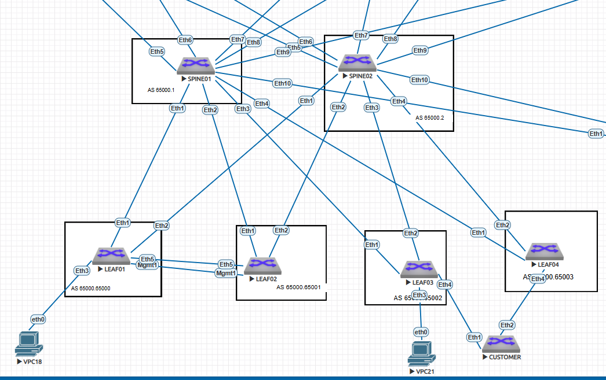

# Настройка на VXLAN фабрике MC-LAG (LEAF01-02) и ESI LAG (LEAF03-04)

### Цель:
Посмотреть и сравнить настройки и работу MC-LAG и ESI LAG на ARISTA <br>
На коммутаторах LEAF01-02 будет настроен MC-LAG <br>
На коммутаторах LEAF03-04 будет настроен ESI LAG.<br>
Проведем тесты отказоустойчивости<br>

### Принципы назначения IP адресов, адресное пространство
Описаны в документе: [README.md](README.md)

### Итоговая схема


## Конфигурации устройств:

|                             |
|-----------------------------|
| [SPINE01.cfg](SPINE01.txt)  | 
| [SPINE02.cfg](SPINE02.txt)  | 
| [LEAF01.cfg](LEAF01.txt)    |
| [LEAF02.cfg](LEAF02.txt)    |
| [LEAF03.cfg](LEAF03.txt)    |
| [LEAF04.cfg](LEAF04.txt)    |

### Для MLAG на LEAF01 И LEAF02 потребуется создать Peer-link 


```
# leaf01
vlan 4000
   name =MLAG_Peer_VLAN=
   trunk group MLAG_Peer
!
interface Vlan4000
  ip address 10.40.0.254/31
!

interface Port-Channel4000
   description =MLAG_Peer=
   switchport trunk group MLAG_Peer
   spanning-tree link-type point-to-point
!
interface Ethernet5
   description =MLAG_peer_link=
   channel-group 4000 mode active
!
interface Port-Channel4000
   description =MLAG_Peer=
   switchport mode trunk
   switchport trunk group MLAG_Peer
   spanning-tree link-type point-to-point
!
exit
 no spanning-tree vlan 4000
!
mlag configuration
   domain-id LEAF01-02
   local-interface Vlan4000
   peer-address 10.40.0.255
   peer-link Port-Channel4000
no shut
!
ip virtual-router mac-address babe.face.fade
```

```
# leaf02
vlan 4000
   name =MLAG_Peer_VLAN=
   trunk group MLAG_Peer
!
interface Vlan4000
  ip address 10.40.0.255/31
!

interface Port-Channel4000
   description =MLAG_Peer=
   switchport trunk group MLAG_Peer
   spanning-tree link-type point-to-point
!
interface Ethernet5
   description =MLAG_peer_link=
   channel-group 4000 mode active
!
interface Port-Channel4000
   description =MLAG_Peer=
   switchport mode trunk
   switchport trunk group MLAG_Peer
   spanning-tree link-type point-to-point
!
exit
 no spanning-tree vlan 4000
!
mlag configuration
   domain-id LEAF01-02
   local-interface Vlan4000
   peer-address 10.40.0.254
   peer-link Port-Channel4000
no shut
!
ip virtual-router mac-address babe.face.fade
```

### Для повышения отказоустойчивости создаем интерфейс Dual Active Detection (DAD) во избежание split-brain при аварии. В качестве DAD линка используем MGMT интерфейс

```
На LEAF01:

int management1
 vrf mgmt
 ip add 172.16.0.1/24
!
mlag configuration
 peer-address heartbeat 172.16.0.2 vrf mgmt
 dual-primary detection delay 10 action errdisable all-interfaces

На LEAF02:

int management1
 vrf mgmt
 ip add 172.16.0.2/24
!
mlag configuration
 peer-address heartbeat 172.16.0.1 vrf mgmt
 dual-primary detection delay 10 action errdisable all-interfaces
```


## Добавляем новые Lo1 для обоих пиров. Запускаем их в BGP процесс для Underlay.  Используем их в качестве адресов VTEP.

```
LEAF01:

interface Loopback2
   ip address 10.11.2.3/32
!
interface Vxlan1
vxlan source-interface Loopback2

LEAF02:

interface Loopback2
   ip address 10.11.2.3/32
!
interface Vxlan1
vxlan source-interface Loopback2
```

## Проверяем состояние MLAG и его конфигурацию:
```
dc01-pod01-leaf01#show mlag config-sanity
No per interface configuration inconsistencies found.

Global configuration inconsistencies:
   Feature                            Attribute       Local value    Peer value
------------- ------------------------------------ ----------------- ----------
  bridging      mlag-peer trunk-group vlan 4001                 -          True

```

```
dc01-pod01-leaf01#show mlag detail
MLAG Configuration:
domain-id                          :           LEAF01-02
local-interface                    :            Vlan4000
peer-address                       :         10.40.0.255
peer-link                          :    Port-Channel4000
hb-peer-address                    :          172.16.0.2
hb-peer-vrf                        :                mgmt
peer-config                        :        inconsistent

MLAG Status:
state                              :              Active
negotiation status                 :           Connected
peer-link status                   :                  Up
local-int status                   :                  Up
system-id                          :   52:00:00:03:37:66
dual-primary detection             :          Configured
dual-primary interface errdisabled :               False

MLAG Ports:
Disabled                           :                   0
Configured                         :                   0
Inactive                           :                   0
Active-partial                     :                   0
Active-full                        :                   0

MLAG Detailed Status:
State                                :             secondary
Peer State                           :               primary
State changes                        :                     2
Last state change time               :    1 day, 1:05:38 ago
Hardware ready                       :                  True
Failover                             :                 False
Failover Cause(s)                    :               Unknown
Last failover change time            :                 never
Secondary from failover              :                 False
Peer MAC address                     :     50:00:00:03:37:66
Peer MAC routing supported           :                 False
Reload delay                         :           300 seconds
Non-MLAG reload delay                :           300 seconds
Ports errdisabled                    :                 False
Lacp standby                         :                 False
Configured heartbeat interval        :               4000 ms
Effective heartbeat interval         :               4000 ms
Heartbeat timeout                    :              60000 ms
Last heartbeat timeout               :                 never
Heartbeat timeouts since reboot      :                     0
UDP heartbeat alive                  :                  True
Heartbeats sent/received             :           22613/44894
Peer monotonic clock offset          :   3068.649741 seconds
Agent should be running              :                  True
P2p mount state changes              :                     1
Fast MAC redirection enabled         :                 False
Interface activation interlock       :           unsupported
Dual-primary detection delay         :                    10
Dual-primary action                  :        errdisable-all
Dual-primary recovery delay          :                     0
Dual-primary non-mlag recovery delay :                     0

```

```
dc01-pod01-leaf01#show lacp 4000 internal brief
LACP System-identifier: 8000,50-00-00-d5-5d-c0
MLAG System-identifier: 8000,52-00-00-03-37-66
State: A = Active, P = Passive; S=ShortTimeout, L=LongTimeout;
       G = Aggregable, I = Individual; s+=InSync, s-=OutOfSync;
       C = Collecting, X = state machine expired,
       D = Distributing, d = default neighbor state
               | Partner                                 Actor
Port   Status  | Sys-id                  Port#  State    OperKey  PortPriority
----- ---------|------------------------ ------ -------- -------- -------------
Port Channel Port-Channel4000:
Et5    Bundled | 8000,50-00-00-03-37-66      5  ALGs+CD   0x08fa         32768

                         |
   Port         Status   |TimeoutMultiplier
---------- --------------|-----------------
Port Channel Port-Channel4000:
   Et5          Bundled  |
```

##### Делаем проверку связности с АРМ, включенного в LEAF01:

```
VPCS> ping 10.88.88.3 -t

84 bytes from 10.88.88.3 icmp_seq=1 ttl=64 time=37.993 ms
84 bytes from 10.88.88.3 icmp_seq=2 ttl=64 time=279.531 ms
84 bytes from 10.88.88.3 icmp_seq=3 ttl=64 time=59.855 ms
84 bytes from 10.88.88.3 icmp_seq=4 ttl=64 time=38.192 ms
84 bytes from 10.88.88.3 icmp_seq=5 ttl=64 time=35.755 ms
84 bytes from 10.88.88.3 icmp_seq=6 ttl=64 time=46.501 ms
84 bytes from 10.88.88.3 icmp_seq=7 ttl=64 time=132.352 ms
84 bytes from 10.88.88.3 icmp_seq=8 ttl=64 time=57.220 m
```

##### Если отключить аплинки у LEAF01 то пинг прерывается.  Что обьяснимо, так как устройство включено как орфан без мультихоминга.  При этом у нас не включены какие-либо механизмы подавления орфан портов при такой аварии.  Также мы могли бы настроить мониторинг аплинк с принудительным отключение орфан-доунлинк.  Но поскольку у нас жив второй LEAF02, то сделаем возможность такому хосту таки иметь возможность добраться до сети назначения. При падении всех uplink на LEAF01 ему просто неоткуда получить анонсы сетей, настроим чтобы он мог их получить от соседнего линка по этому же peer-link.

##### Для решения этой проблемы настроил EBGP пиринг между LEAF01 и LEAF02 так как пиры настроил в разных AS. В этом случае не требуется как для IBGP включать next-hop-self

```
Добавим еще один VLAN в peer-link и добавим eBGP сессию между LEAF01 и LEAF02 в underlay


LEAF01
!
vlan 4001
 name -VLAN_LEAF_to_LEAF
 trunk group MLAG-peer
!
int vlan 4001
 ip add 10.0.3.0/31
 mtu 9214
!
 no spanning-tree vlan-id 4001
!


router bgp 65000.65000
 neighbor underlay_ebgp remote-as 65000.65001
 neighbor underlay_ebgp maximum-routes 12000 warning-only
 neighbor 10.0.3.1 peer group underlay_ebgp

LEAF02

!
vlan 4001
 name -VLAN_LEAF_to_LEAF
 trunk group MLAG-peer
!
int vlan 4001
 ip add 10.0.3.1/31
 mtu 9214
!
 no spanning-tree vlan-id 4001
!


router bgp 65000.65001
 neighbor underlay_ebgp remote-as 65000.65000
 neighbor underlay_ebgp maximum-routes 12000 warning-only
 neighbor 10.0.3.0 peer group underlay_ebgp

```

### Теперь пинг с АРМа включенного в LEAF01 не пропадает после отказа обоих аплинков LEAF01:

```
VPCS> ping 10.88.88.3 -t

84 bytes from 10.88.88.3 icmp_seq=1 ttl=64 time=37.993 ms
84 bytes from 10.88.88.3 icmp_seq=2 ttl=64 time=279.531 ms
84 bytes from 10.88.88.3 icmp_seq=3 ttl=64 time=59.855 ms
84 bytes from 10.88.88.3 icmp_seq=4 ttl=64 time=38.192 ms
84 bytes from 10.88.88.3 icmp_seq=5 ttl=64 time=35.755 ms
84 bytes from 10.88.88.3 icmp_seq=6 ttl=64 time=46.501 ms
84 bytes from 10.88.88.3 icmp_seq=7 ttl=64 time=132.352 ms
84 bytes from 10.88.88.3 icmp_seq=8 ttl=64 time=57.220 ms
84 bytes from 10.88.88.3 icmp_seq=9 ttl=64 time=97.758 ms
84 bytes from 10.88.88.3 icmp_seq=10 ttl=64 time=82.558 ms
84 bytes from 10.88.88.3 icmp_seq=11 ttl=64 time=47.893 ms
84 bytes from 10.88.88.3 icmp_seq=12 ttl=64 time=38.810 ms
84 bytes from 10.88.88.3 icmp_seq=13 ttl=64 time=50.982 ms
10.88.88.3 icmp_seq=14 timeout
10.88.88.3 icmp_seq=15 timeout
10.88.88.3 icmp_seq=16 timeout
84 bytes from 10.88.88.3 icmp_seq=17 ttl=64 time=81.241 ms
84 bytes from 10.88.88.3 icmp_seq=18 ttl=64 time=91.011 ms
84 bytes from 10.88.88.3 icmp_seq=19 ttl=64 time=71.535 ms
84 bytes from 10.88.88.3 icmp_seq=20 ttl=64 time=84.595 ms
84 bytes from 10.88.88.3 icmp_seq=21 ttl=64 time=70.167 ms

```

## Настройка ESI  на LEAF03 и LEAF04

Обьем настроек существенно меньше, для тестов отказоустойчивости добавил коммутатор CUSTOMER эмулирующий "сервер" <br>

```

На LEAF03:

!
vlan 201-202
   name =ESI_CUSTOMER
!
interface Ethernet4
   description =ESI_LAG=
   mtu 9214
   channel-group 1 mode active
!
interface Port-Channel1
   switchport trunk allowed vlan 201-202
   switchport mode trunk
   !
   evpn ethernet-segment
      identifier 0000:babe:face:fade:bace
   lacp system-id fade.babe.face
route-target import ba:be:fa:ce:ba:ce
!
interface Vlan201
   vrf CUSTOMER_L3VNI
   ip address 1.1.1.2/24
   ip virtual-router address 1.1.1.254/24
!
interface Vlan202
   vrf CUSTOMER_L3VNI
   ip address 2.2.2.3/24
   ip virtual-router address 2.2.2.254/24
!
И добавляем в BGP настройки:

 vlan-aware-bundle TEST_ESI_LAG
      rd 0.0.0.1:1
      route-target both 100:100
      redistribute learned
      vlan 201-202

На LEAF04 Настройки аналогичны, отличаются только IP интерфейсов VLAN201-202
```

### Проверки показывают, что при любых отказах ESI LAG отрабатывает очень быстро (пингуем с коммутатора CUSTOMER LEAF01 в другом конце ФАбрики:
```
CUSTOMER#ping 10.30.30.3 repeat 10000
PING 10.30.30.3 (10.30.30.3) 72(100) bytes of data.
80 bytes from 10.30.30.3: icmp_seq=1 ttl=63 time=198 ms
80 bytes from 10.30.30.3: icmp_seq=2 ttl=63 time=197 ms
80 bytes from 10.30.30.3: icmp_seq=3 ttl=63 time=213 ms
80 bytes from 10.30.30.3: icmp_seq=4 ttl=63 time=208 ms
80 bytes from 10.30.30.3: icmp_seq=5 ttl=63 time=259 ms
80 bytes from 10.30.30.3: icmp_seq=6 ttl=63 time=269 ms
80 bytes from 10.30.30.3: icmp_seq=7 ttl=63 time=291 ms
80 bytes from 10.30.30.3: icmp_seq=8 ttl=63 time=299 ms
80 bytes from 10.30.30.3: icmp_seq=9 ttl=63 time=317 ms
80 bytes from 10.30.30.3: icmp_seq=10 ttl=63 time=326 ms
80 bytes from 10.30.30.3: icmp_seq=11 ttl=63 time=410 ms
80 bytes from 10.30.30.3: icmp_seq=12 ttl=63 time=495 ms
80 bytes from 10.30.30.3: icmp_seq=13 ttl=63 time=528 ms
80 bytes from 10.30.30.3: icmp_seq=14 ttl=63 time=545 ms
80 bytes from 10.30.30.3: icmp_seq=15 ttl=63 time=552 ms
80 bytes from 10.30.30.3: icmp_seq=16 ttl=63 time=550 ms
80 bytes from 10.30.30.3: icmp_seq=17 ttl=63 time=551 ms
80 bytes from 10.30.30.3: icmp_seq=18 ttl=63 time=298 ms
80 bytes from 10.30.30.3: icmp_seq=19 ttl=63 time=86.1 ms
80 bytes from 10.30.30.3: icmp_seq=20 ttl=63 time=157 ms
80 bytes from 10.30.30.3: icmp_seq=21 ttl=63 time=90.2 ms
80 bytes from 10.30.30.3: icmp_seq=22 ttl=63 time=103 ms
80 bytes from 10.30.30.3: icmp_seq=23 ttl=63 time=76.5 ms
80 bytes from 10.30.30.3: icmp_seq=24 ttl=63 time=83.1 ms
80 bytes from 10.30.30.3: icmp_seq=25 ttl=63 time=89.2 ms
80 bytes from 10.30.30.3: icmp_seq=26 ttl=63 time=139 ms
80 bytes from 10.30.30.3: icmp_seq=27 ttl=63 time=81.7 ms
80 bytes from 10.30.30.3: icmp_seq=28 ttl=63 time=80.6 ms
80 bytes from 10.30.30.3: icmp_seq=29 ttl=63 time=83.2 ms
80 bytes from 10.30.30.3: icmp_seq=30 ttl=63 time=122 ms
80 bytes from 10.30.30.3: icmp_seq=31 ttl=63 time=82.3 ms
80 bytes from 10.30.30.3: icmp_seq=32 ttl=63 time=72.5 ms
80 bytes from 10.30.30.3: icmp_seq=33 ttl=63 time=78.5 m
```

### Проверяем наличие Type-1 и Type-4 маршрутов на LEAF01:
```
dc01-pod01-leaf01#show bgp evpn route-type auto-discovery
BGP routing table information for VRF default
Router identifier 10.11.1.3, local AS number 4259905000
Route status codes: * - valid, > - active, S - Stale, E - ECMP head, e - ECMP
                    c - Contributing to ECMP, % - Pending BGP convergence
Origin codes: i - IGP, e - EGP, ? - incomplete
AS Path Attributes: Or-ID - Originator ID, C-LST - Cluster List, LL Nexthop - Link Local Nexthop

          Network                Next Hop              Metric  LocPref Weight  Path
 * >Ec    RD: 0.0.0.1:1 auto-discovery 100201 0000:babe:face:fade:bace
                                 10.11.1.5             -       100     0       4259840001 4259905002 i
 *  ec    RD: 0.0.0.1:1 auto-discovery 100201 0000:babe:face:fade:bace
                                 10.11.1.5             -       100     0       4259840002 4259905002 i
 * >Ec    RD: 0.0.0.1:1 auto-discovery 100202 0000:babe:face:fade:bace
                                 10.11.1.5             -       100     0       4259840002 4259905002 i
 *  ec    RD: 0.0.0.1:1 auto-discovery 100202 0000:babe:face:fade:bace
                                 10.11.1.5             -       100     0       4259840001 4259905002 i
 * >Ec    RD: 10.11.1.5:1 auto-discovery 0000:babe:face:fade:bace
                                 10.11.1.5             -       100     0       4259840002 4259905002 i
 *  ec    RD: 10.11.1.5:1 auto-discovery 0000:babe:face:fade:bace
                                 10.11.1.5             -       100     0       4259840001 4259905002 i
 * >Ec    RD: 10.11.1.6:1 auto-discovery 0000:babe:face:fade:bace
                                 10.11.1.6             -       100     0       4259840002 4259905003 i
 *  ec    RD: 10.11.1.6:1 auto-discovery 0000:babe:face:fade:bace
                                 10.11.1.6             -       100     0       4259840001 4259905003 i
```
### Смотрим Type-4 анонсы:

```
dc01-pod01-leaf01#show bgp evpn route-type ethernet-segment
BGP routing table information for VRF default
Router identifier 10.11.1.3, local AS number 4259905000
Route status codes: * - valid, > - active, S - Stale, E - ECMP head, e - ECMP
                    c - Contributing to ECMP, % - Pending BGP convergence
Origin codes: i - IGP, e - EGP, ? - incomplete
AS Path Attributes: Or-ID - Originator ID, C-LST - Cluster List, LL Nexthop - Link Local Nexthop

          Network                Next Hop              Metric  LocPref Weight  Path
 * >Ec    RD: 10.11.1.5:1 ethernet-segment 0000:babe:face:fade:bace 10.11.1.5
                                 10.11.1.5             -       100     0       4259840001 4259905002 i
 *  ec    RD: 10.11.1.5:1 ethernet-segment 0000:babe:face:fade:bace 10.11.1.5
                                 10.11.1.5             -       100     0       4259840002 4259905002 i
 * >Ec    RD: 10.11.1.6:1 ethernet-segment 0000:babe:face:fade:bace 10.11.1.6
                                 10.11.1.6             -       100     0       4259840001 4259905003 i
 *  ec    RD: 10.11.1.6:1 ethernet-segment 0000:babe:face:fade:bace 10.11.1.6
                                 10.11.1.6             -       100     0       4259840002 4259905003 i

```
### Проверяем состояние LACP на коммутаторе CUSTOMER
```
CUSTOMER#show lacp 1 peer all-ports
State: A = Active, P = Passive; S=ShortTimeout, L=LongTimeout;
       G = Aggregable, I = Individual; s+=InSync, s-=OutOfSync;
       C = Collecting, X = state machine expired,
       D = Distributing, d = default neighbor state
                 |                        Partner
 Port    Status  | Sys-id                    Port#   State     OperKey  PortPri
------ ----------|------------------------- ------- --------- --------- -------
Port Channel Port-Channel1:
 Et1     Bundled | 8000,fa-de-ba-be-fa-ce        4   ALGs+CD    0x0001    32768
 Et2     Bundled | 8000,fa-de-ba-be-fa-ce        4   ALGs+CD    0x0001    32768

```
### Проверяем состояние ESI LAG
```
dc01-pod01-leaf03#show bgp evpn instance vlan-aware-bundle TEST_ESI_LAG
EVPN instance: VLAN-aware bundle TEST_ESI_LAG
  Route distinguisher: 0.0.0.1:1
  Route target import: Route-Target-AS:100:100
  Route target export: Route-Target-AS:100:100
  Service interface: VLAN-aware bundle
  Local VXLAN IP address: 10.11.1.5
  VXLAN: enabled
  MPLS: disabled
  Local ethernet segment:
    ESI: 0000:babe:face:fade:bace
      Interface: Port-Channel1
      Mode: all-active
      State: up
      ES-Import RT:
      DF election algorithm: modulus
      Designated forwarder: 10.11.1.5
```
