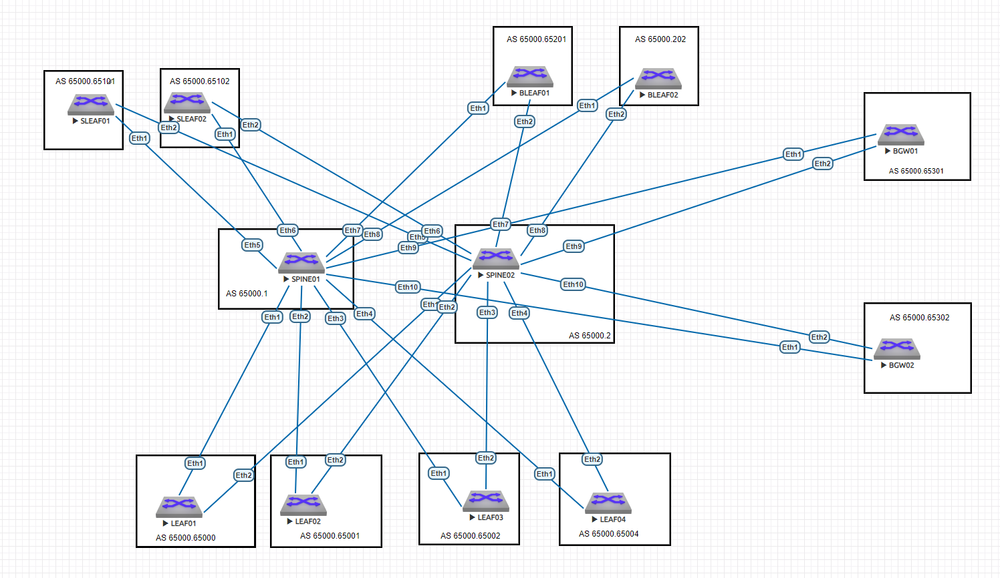

# Настройка L3VNI на фабрике и сравнение Assimetric и Symmetric IRB

### Цель:
Посмотреть два режима работы маршрутизации в Фабрике:  
Assymetric IRB  (требует наличия на каждом коммутаторе обоих SVI для маршрутизации между ними.  
Symmetric IRB (требует наличия L3VNI для связи VLAN между собой). 
Настройка L3VNI на фабрике. 
Проверка L3 связности. 

### Принципы назначения IP адресов, адресное пространство
Описаны в документе: [README.md](README.md)

### Итоговая схема

## Конфигурации устройств:

|                             |                               |                            |                        |
|-----------------------------|-------------------------------|----------------------------|------------------------|
| [SPINE01.cfg](SPINE01.txt)  |   [BLEAF01.cfg](BLEAF01.txt)  | [SLEAF01.cfg](SLEAF01.txt) | [BGW01.cfg](BGW01.txt) |
| [SPINE02.cfg](SPINE02.txt)  |   [BLEAF02.cfg](BLEAF02.txt)  | [SLEAF02.cfg](SLEAF02.txt) | [BGW02.cfg](BGW02.txt) |
| [LEAF01.cfg](LEAF01.txt)    |-------------------------------|----------------------------|------------------------|
| [LEAF02.cfg](LEAF02.txt)    |-------------------------------|----------------------------|------------------------|
| [LEAF03.cfg](LEAF03.txt)    |-------------------------------|----------------------------|------------------------|
| [LEAF04.cfg](LEAF04.txt)    |-------------------------------|----------------------------|------------------------|

### Выбран eBGP и выбрана не единая, а разные AS для SPINE  намеренно, чтобы взять наиболее сложный кейс. В случае единой AS на SPINE настроек бы потребовалось меньше.

### Bleaf и BGW пришлось отключить, так как стенд не справляется с нагрузкой

### as-path multypath relax включен по умолчанию

###  maximum path 2 настроен, так как SPINE в схеме всего 2

### На SPINE настроен next hop unchanged

### На разных устройства намеренно BGPv4 включен по разному (через network и через neightbor activate)

### VLAN 10 и VLAN 20 созданы только на Leaf01 и Leaf03 для проверки Assimetric IRB. Для них VRF и L3VNI не создавались.

dc01-pod01-leaf01#   

interface Vlan10   
   ip address 10.88.88.2/24   
   ip virtual-router address 10.88.88.1/24   
!   
interface Vlan20   
   ip address 10.10.10.2/24   
   ip virtual-router address 10.10.10.1/24   

dc01-pod01-leaf02#   

interface Vlan10  
   ip address 10.88.88.3/24  
   ip virtual-router address 10.88.88.1/24  
!  
interface Vlan20  
   ip address 10.10.10.3/24  
   ip virtual-router address 10.10.10.1/24  

### VLAN 30 и VLAN 40   созданы только на Leaf02 и Leaf04 для проверки работы Symmetric IRB.  Для них создан VRF СUSTOMER_L3VNI и собственно L3VNI.

## Подтверждение работоспособности Assimetric IRB

Небольшая 

## Подтверждение работоспособности L3VNI:

### show bgp evpn summary

##### dc01-pod01-spine01
dc01-pod01-spine01#show bgp evpn summary
BGP summary information for VRF default
Router identifier 10.11.1.1, local AS number 4259840001
Neighbor Status Codes: m - Under maintenance

|      |Description|Neighbor  |V  |AS        |MsgRcvd|MsgSent|InQ|OutQ|Up/Down |State |PfxRcd|PfxAcc|
|------|-----------|----------|---|----------|-------|-------|---|----|--------|------|------|------|
|      |LEAF01_Lo1 |10.11.1.3 |4  |4259905000|89     |120    |0  |0   |00:27:41|Estab |2     |2     |
|      |LEAF02_Lo1 |10.11.1.4 |4  |4259905001|177    |307    |0  |0   |00:36:26|Estab |1     |1     |
|      |LEAF03_Lo1 |10.11.1.5 |4  |4259905002|164    |287    |0  |0   |00:36:17|Estab |2     |2     |
|      |LEAF04_Lo1 |10.11.1.6 |4  |4259905003|192    |312    |0  |0   |00:36:15|Estab |1     |1     |
|      |SLEAF01_Lo1|10.11.1.7 |4  |4259905101|146    |254    |0  |0   |00:35:43|Estab |1     |1     |
|      |SLEAF02_Lo1|10.11.1.8 |4  |4259905102|145    |284    |0  |0   |00:36:07|Estab |1     |1     |
|      |BLEAF01_Lo1|10.11.1.9 |4  |4259905201|0      |0      |0  |0   |00:57:45|Active|      |      |
|      |BLEAF02_Lo1|10.11.1.10|4  |4259905202|0      |0      |0  |0   |00:57:45|Active|      |      |
|      |BGW01_Lo1  |10.11.1.11|4  |4259905301|0      |0      |0  |0   |00:57:45|Active|      |      |
|      |BGW02_Lo1  |10.11.1.12|4  |4259905302|0      |0      |0  |0   |00:57:44|Active|      |      |

##### dc01-pod01-spine02
dc01-pod01-spine01#show bgp evpn summary
BGP summary information for VRF default
Router identifier 10.11.1.2, local AS number 4259840002
Neighbor Status Codes: m - Under maintenance

|Description|Neighbor   |V         |AS |MsgRcvd   |MsgSent|InQ|OutQ|Up/Down|State   |PfxRcd|PfxAcc|FIELD13|
|-----------|-----------|----------|---|----------|-------|---|----|-------|--------|------|------|-------|
|           |LEAF01_Lo1 |10.11.1.3 |4  |4259905000|109    |110|0   |0      |00:36:48|Estab |1     |1      |
|           |LEAF02_Lo1 |10.11.1.4 |4  |4259905001|178    |209|0   |0      |00:38:02|Estab |1     |1      |
|           |LEAF03_Lo1 |10.11.1.5 |4  |4259905002|192    |284|0   |0      |00:38:08|Estab |1     |1      |
|           |LEAF04_Lo1 |10.11.1.6 |4  |4259905003|174    |220|0   |0      |00:38:21|Estab |1     |1      |
|           |SLEAF01_Lo1|10.11.1.7 |4  |4259905101|165    |173|0   |0      |00:37:19|Estab |1     |1      |
|           |SLEAF02_Lo1|10.11.1.8 |4  |4259905102|152    |259|0   |0      |00:37:18|Estab |1     |1      |
|           |BLEAF01_Lo1|10.11.1.9 |4  |4259905201|0      |0  |0   |0      |01:05:39|Active|      |       |
|           |BLEAF02_Lo1|10.11.1.10|4  |4259905202|0      |0  |0   |0      |01:05:39|Active|      |       |
|           |BGW01_Lo1  |10.11.1.11|4  |4259905301|0      |0  |0   |0      |01:05:41|Active|      |       |
|           |BGW02_Lo1  |10.11.1.12|4  |4259905302|0      |0  |0   |0      |01:05:38|Active|      |       |

##### dc01-pod01-leaf01
dc01-pod01-leaf01#show bgp evpn summary
BGP summary information for VRF default
Router identifier 10.11.1.3, local AS number 4259905000
Neighbor Status Codes: m - Under maintenance

|      |Description|Neighbor |V  |AS        |MsgRcvd|MsgSent|InQ|OutQ|Up/Down |State|PfxRcd|PfxAcc|
|------|-----------|---------|---|----------|-------|-------|---|----|--------|-----|------|------|
|      |SPINE01_Lo1|10.11.1.1|4  |4259840001|137    |109    |0  |0   |00:30:55|Estab|1     |1     |
|      |SPINE02_Lo1|10.11.1.2|4  |4259840002|109    |110    |0  |0   |00:38:18|Estab|1     |1     |

##### dc01-pod01-leaf02
dc01-pod01-leaf02#show bgp evpn summary
BGP summary information for VRF default
Router identifier 10.11.1.4, local AS number 4259905001
Neighbor Status Codes: m - Under maintenance

|      |Description|Neighbor |V  |AS        |MsgRcvd|MsgSent|InQ|OutQ|Up/Down |State|PfxRcd|PfxAcc|
|------|-----------|---------|---|----------|-------|-------|---|----|--------|-----|------|------|
|      |SPINE01_Lo1|10.11.1.1|4  |4259840001|227    |231    |0  |0   |00:40:57|Estab|2     |2     |
|      |SPINE02_Lo1|10.11.1.2|4  |4259840002|196    |194    |0  |0   |00:40:48|Estab|2     |2     |

##### dc01-pod01-leaf03
dc01-pod01-leaf03#show bgp evpn summary
BGP summary information for VRF default
Router identifier 10.11.1.5, local AS number 4259905002
Neighbor Status Codes: m - Under maintenance

|      |Description|Neighbor |V  |AS        |MsgRcvd|MsgSent|InQ|OutQ|Up/Down |State|PfxRcd|PfxAcc|
|------|-----------|---------|---|----------|-------|-------|---|----|--------|-----|------|------|
|      |SPINE01_Lo1|10.11.1.1|4  |4259840001|279    |246    |0  |0   |00:41:51|Estab|1     |1     |
|      |SPINE02_Lo1|10.11.1.2|4  |4259840002|266    |220    |0  |0   |00:41:58|Estab|1     |1     |

##### dc01-pod01-leaf04
dc01-pod01-leaf04#show bgp evpn summary
BGP summary information for VRF default
Router identifier 10.11.1.6, local AS number 4259905003
Neighbor Status Codes: m - Under maintenance

|      |Description|Neighbor |V  |AS        |MsgRcvd|MsgSent|InQ|OutQ|Up/Down |State|PfxRcd|PfxAcc|
|------|-----------|---------|---|----------|-------|-------|---|----|--------|-----|------|------|
|      |SPINE01_Lo1|10.11.1.1|4  |4259840001|269    |247    |0  |0   |00:42:47|Estab|2     |2     |
|      |SPINE02_Lo1|10.11.1.2|4  |4259840002|207    |197    |0  |0   |00:43:10|Estab|2     |2     |

##### dc01-pod01-Sleaf01
dc01-pod01-Sleaf01#show bgp evpn summary
BGP summary information for VRF default
Router identifier 10.11.1.7, local AS number 4259905101
Neighbor Status Codes: m - Under maintenance

|      |Description|Neighbor |V  |AS        |MsgRcvd|MsgSent|InQ|OutQ|Up/Down |State|PfxRcd|PfxAcc|
|------|-----------|---------|---|----------|-------|-------|---|----|--------|-----|------|------|
|      |SPINE01_Lo1|10.11.1.1|4  |4259840001|169    |192    |0  |0   |00:43:15|Estab|2     |2     |
|      |SPINE02_Lo1|10.11.1.2|4  |4259840002|151    |189    |0  |0   |00:43:05|Estab|2     |2     |

##### dc01-pod01-Sleaf02
dc01-pod01-Sleaf02#show bgp evpn summary
BGP summary information for VRF default
Router identifier 10.11.1.8, local AS number 4259905102
Neighbor Status Codes: m - Under maintenance

|      |Description|Neighbor |V  |AS        |MsgRcvd|MsgSent|InQ|OutQ|Up/Down |State|PfxRcd|PfxAcc|
|------|-----------|---------|---|----------|-------|-------|---|----|--------|-----|------|------|
|      |SPINE01_Lo1|10.11.1.1|4  |4259840001|214    |194    |0  |0   |00:44:17|Estab|2     |2     |
|      |SPINE02_Lo1|10.11.1.2|4  |4259840002|252    |181    |0  |0   |00:43:53|Estab|2     |2     |
  

##### dc01-pod01-leaf01#show interfaces vxlan 1

|Vxlan1 is up                                                    |line protocol is up (connected)|
|----------------------------------------------------------------|-------------------------------|
|  Hardware is Vxlan                                             |                               |
|  Description: =VXLAN=                                          |                               |
|  Source interface is Loopback2 and is active with 10.11.2.3    |                               |
|  Listening on UDP port 4789                                    |                               |
|  Replication/Flood Mode is headend with Flood List Source: EVPN|                               |
|  Remote MAC learning via EVPN                                  |                               |
|  VNI mapping to VLANs                                          |                               |
|  Static VLAN to VNI mapping is                                 |                               |
|    [10                                                         | 100010]                       |
|  Note: All Dynamic VLANs used by VCS are internal VLANs.       |                               |
|        Use 'show vxlan vni' for details.                       |                               |
|  Static VRF to VNI mapping is not configured                   |                               |
|  Headend replication flood vtep list is:                       |                               |
|    10 10.11.2.5                                                |                               |
|  Shared Router MAC is 0000.0000.0000                           |                               |

##### dc01-pod01-leaf03#show interfaces vxlan 1

|Vxlan1 is up                                                    |line protocol is up (connected)|
|----------------------------------------------------------------|-------------------------------|
|  Hardware is Vxlan                                             |                               |
|  Description: =VXLAN=                                          |                               |
|  Source interface is Loopback2 and is active with 10.11.2.5    |                               |
|  Listening on UDP port 4789                                    |                               |
|  Replication/Flood Mode is headend with Flood List Source: EVPN|                               |
|  Remote MAC learning via EVPN                                  |                               |
|  VNI mapping to VLANs                                          |                               |
|  Static VLAN to VNI mapping is                                 |                               |
|    [10                                                         | 100010]                       |
|  Note: All Dynamic VLANs used by VCS are internal VLANs.       |                               |
|        Use 'show vxlan vni' for details.                       |                               |
|  Static VRF to VNI mapping is not configured                   |                               |
|  Headend replication flood vtep list is:                       |                               |
|    10 10.11.2.3                                                |                               |
|  Shared Router MAC is 0000.0000.0000                           |                               |

##### dc01-pod01-leaf01#show vxlan vtep

|Remote VTEPS for Vxlan1|              |
|-----------------------|--------------|
|VTEP            Tunnel Type(s)|              |
|--------------- --------------|              |
|10.11.2.5       flood  |              |
|Total number of remote VTEPS|  1           |

##### dc01-pod01-leaf03#show vxlan vtep

|Remote VTEPS for Vxlan1       |      |
|------------------------------|------|
|VTEP            Tunnel Type(s)|      |
|--------------- --------------|      |
|10.11.2.5       flood         |      |
|Total number of remote VTEPS  |  1   |

#### dc01-pod01-leaf03#
show mac address-table

|------------------------------------------------------------------  |
|--------------------------------------------------------------------|
|Vlan    Mac Address       Type        Ports      Moves   Last Move  |
|----    -----------       ----        -----      -----   ---------  |
|   1    0000.0000.0010    STATIC      Cpu                           |
|  10    0000.0000.0010    STATIC      Cpu                           |
|  10    0050.7966.6812    DYNAMIC     Vx1        1       0:00:22 ago|
|  10    0050.7966.6815    DYNAMIC     Et3        1       0:00:23 ago|
|Total Mac Addresses for this criterion: 4                           |
|          Multicast Mac Address Table                               |
|------------------------------------------------------------------  |
|Vlan    Mac Address       Type        Ports                         |
|----    -----------       ----        -----                         |
|Total Mac Addresses for this criterion: 0                           |

#### dc01-pod01-leaf01
#show vxlan address-table

|----------------------------------------------------------------------   |
|-------------------------------------------------------------------------|
|VLAN  Mac Address     Type      Prt  VTEP             Moves   Last Move  |
|----  -----------     ----      ---  ----             -----   ---------  |
|  10  0050.7966.6815  EVPN      Vx1  10.11.2.5        1       0:01:40 ago|
|Total Remote Mac Addresses for this criterion: 1                         |

#### dc01-pod01-leaf01# show bgp evpn route-type mac-ip
BGP routing table information for VRF default
Router identifier 10.11.1.3, local AS number 4259905000
Route status codes: * - valid, > - active, S - Stale, E - ECMP head, e - ECMP
                    c - Contributing to ECMP, % - Pending BGP convergence
Origin codes: i - IGP, e - EGP, ? - incomplete
AS Path Attributes: Or-ID - Originator ID, C-LST - Cluster List, LL Nexthop - Link Local Nexthop

|      |Network  |Next|Hop|Metric      |LocPref   |Weight        |Path|
|------|---------|----|---|------------|----------|--------------|----|
|      |*        |>   |RD:|10.11.1.3:10|mac-ip    |0050.7966.6812|    |
|      |-        |-   |-  |0           |i         |              |    |
|      |*        |>Ec |RD:|10.11.1.5:10|mac-ip    |0050.7966.6815|    |
|      |10.11.2.5|-   |100|0           |4259840002|4259905002    |i   |
|      |*        |ec  |RD:|10.11.1.5:10|mac-ip    |0050.7966.6815|    |
|      |10.11.2.5|-   |100|0           |4259840001|4259905002    |i   |

#### dc01-pod01-leaf03#show bgp evpn route-type mac-ip
BGP routing table information for VRF default
Router identifier 10.11.1.5, local AS number 4259905002
Route status codes: * - valid, > - active, S - Stale, E - ECMP head, e - ECMP
                    c - Contributing to ECMP, % - Pending BGP convergence
Origin codes: i - IGP, e - EGP, ? - incomplete
AS Path Attributes: Or-ID - Originator ID, C-LST - Cluster List, LL Nexthop - Link Local Nexthop

|      |Network  |Next|Hop|Metric      |LocPref   |Weight        |Path|
|------|---------|----|---|------------|----------|--------------|----|
|      |*        |>Ec |RD:|10.11.1.3:10|mac-ip    |0050.7966.6812|    |
|      |10.11.2.3|-   |100|0           |4259840001|4259905000    |i   |
|      |*        |ec  |RD:|10.11.1.3:10|mac-ip    |0050.7966.6812|    |
|      |10.11.2.3|-   |100|0           |4259840002|4259905000    |i   |
|      |*        |>   |RD:|10.11.1.5:10|mac-ip    |0050.7966.6815|    |
|      |-        |-   |-  |0           |i         |              |    |

### Главный критерий - IP связность между хостами 10.88.88.3 и 10.88.88.5

|VPCS>|ping |10.88.88.5|FIELD4    |FIELD5    |FIELD6|FIELD7      |FIELD8|
|-----|-----|----------|----------|----------|------|------------|------|
|84   |bytes|from      |10.88.88.5|icmp_seq=1|ttl=64|time=121.441|ms    |
|84   |bytes|from      |10.88.88.5|icmp_seq=2|ttl=64|time=74.594 |ms    |
|84   |bytes|from      |10.88.88.5|icmp_seq=3|ttl=64|time=46.078 |ms    |
|84   |bytes|from      |10.88.88.5|icmp_seq=4|ttl=64|time=60.178 |ms    |
|84   |bytes|from      |10.88.88.5|icmp_seq=5|ttl=64|time=186.543|ms    |

### Как и ожидалось отключение IP адреса на VLAN интерфейсе на связность не влияет.  Его можно вообще не настраивать

###  Далее для VLAN 10 (VNI 10010) был настроен AnyCast GW. (виртуальный IP и виртуальный MAC)
