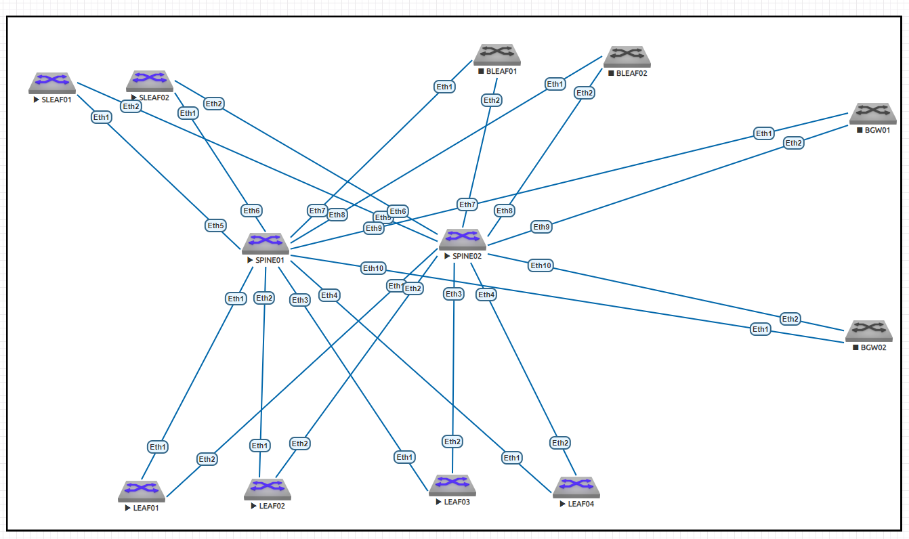

# Настройка eBGPv4 в Underlay

### Цель:
Настройка eBGP в Underlay на фабрике. 
Настроить IP на всех активных портах (PtP линки и loopback1) для дальнейшей работы над проектом. 
Адресное пространство должно быть задокументировано. 

### Принципы назначения IP адресов, адресное пространство
Описаны в документе: [README.md](README.md)

### Итоговая схема

## Конфигурации устройств:

|                             |                               |                            |                        |
|-----------------------------|-------------------------------|----------------------------|------------------------|
| [SPINE01.cfg](SPINE01.txt.txt)  |   [BLEAF01.cfg](BLEAF01.txt.txt)  | [SLEAF01.cfg](SLEAF01.txt.txt) | [BGW01.cfg](BGW01.txt.txt) |
| [SPINE02.cfg](SPINE02.txt.txt)  |   [BLEAF02.cfg](BLEAF02.txt.txt)  | [SLEAF02.cfg](SLEAF02.txt.txt) | [BGW02.cfg](BGW02.txt.txt) |
| [LEAF01.cfg](LEAF01.txt.txt)    |-------------------------------|----------------------------|------------------------|
| [LEAF02.cfg](LEAF02.txt.txt)    |-------------------------------|----------------------------|------------------------|
| [LEAF03.cfg](LEAF03.txt.txt)    |-------------------------------|----------------------------|------------------------|
| [LEAF04.cfg](LEAF04.txt.txt)    |-------------------------------|----------------------------|------------------------|

### Выбран eBGP и выбрана не единая, а разные AS для SPINE  намеренно, чтобы взять наиболее сложный кейс. В случае единой AS на SPINE настроек бы потребовалось меньше.

## Подтверждение работоспособности Топологии:

### show bfd peers

#### dc01-pod01-spine01#
dc01-pod01-spine01#show bfd peers

VRF name: default

|DstAddr   |MyDisc     |YourDisc   |Interface/Transport |Type   |LastUp         |      |
|----------|-----------|-----------|--------------------|-------|---------------|------|
|----------|-----------|-----------|--------------------|-------|---------------|      |
|10.11.3.1 |335813082  |1929710869 |Ethernet1(17)       |normal |12/04/24       |19:49 |
|10.11.3.3 |2725599828 |1491984111 |Ethernet2(18)       |normal |12/03/24       |19:03 |
|10.11.3.5 |803786061  |754367869  |Ethernet3(19)       |normal |12/04/24       |19:49 |
|10.11.3.7 |3866831874 |3902440214 |Ethernet4(20)       |normal |12/04/24       |19:49 |
|10.11.3.9 |2489117290 |1129548199 |Ethernet5(21)       |normal |12/04/24       |19:49 |
|10.11.3.11|1351795425 |655556120  |Ethernet6(22)       |normal |12/04/24       |19:49 |
|10.11.3.13|332182994  |2154089544 |Ethernet7(23)       |normal |12/04/24       |19:39 |
|10.11.3.15|443690072  |2253687946 |Ethernet8(24)       |normal |12/04/24       |19:49 |
|10.11.3.17|461437277  |3948921002 |Ethernet9(25)       |normal |12/04/24       |19:50 |
|10.11.3.19|203427907  |4285677268 |Ethernet10(26)      |normal |12/04/24       |19:46 |

|                    |LastDown           |        | LastDiag           |State |
|--------------------|-------------------|--------|--------------------|------|
|--------------------|-------------------|-----   |                    |      |
|                    |12/04/24           |19:49   |No        Diagnostic|Up    |
|                    |12/03/24           |19:03   |No        Diagnostic|Up    |
|                    |12/04/24           |19:49   |No        Diagnostic|Up    |
|                    |12/04/24           |19:49   |No        Diagnostic|Up    |
|                    |12/04/24           |19:49   |No        Diagnostic|Up    |
|                    |12/04/24           |19:49   |No        Diagnostic|Up    |
|                    |12/04/24           |19:39   |No        Diagnostic|Up    |
|                    |12/04/24           |19:49   |No        Diagnostic|Up    |
|                    |12/04/24           |19:49   |No        Diagnostic|Up    |
|                    |NA                 |        |No       |Diagnostic|Up    |

#### dc01-pod01-spine02#

dc01-pod01-spine02#show bfd peers

VRF name: default

|DstAddr   |MyDisc     |YourDisc   |Interface/Transport |Type   |LastUp         |      |
|----------|-----------|-----------|--------------------|-------|---------------|------|
|10.11.3.41|520134360  |62801290   |Ethernet1(16)       |normal |12/03/24       |18:54 |
|10.11.3.43|385137600  |2127932403 |Ethernet2(17)       |normal |12/03/24       |19:03 |
|10.11.3.45|1263345084 |2170033804 |Ethernet3(18)       |normal |12/03/24       |19:07 |
|10.11.3.47|3366811955 |1133313780 |Ethernet4(19)       |normal |12/03/24       |20:05 |
|10.11.3.49|3316862100 |348420029  |Ethernet5(20)       |normal |12/03/24       |20:11 |
|10.11.3.51|1963678413 |3602484950 |Ethernet6(21)       |normal |12/03/24       |20:08 |
|10.11.3.53|2681666084 |2983510026 |Ethernet7(22)       |normal |12/04/24       |19:39 |
|10.11.3.55|326220918  |3188920055 |Ethernet8(23)       |normal |12/04/24       |19:43 |
|10.11.3.57|2314772213 |986322806  |Ethernet9(24)       |normal |12/04/24       |19:50 |
|10.11.3.59|1266795579 |1385592659 |Ethernet10(25)      |normal |12/04/24       |19:46 |

|                    |LastDown           |LastDiag          | State    |      |
|--------------------|-------------------|------------------|----------|------|
|--------------------|-------------------|-----             |          |      |
|                    |NA                 |No      Diagnostic|Up        |      |
|                    |NA                 |No      Diagnostic|Up        |      |
|                    |NA                 |No      Diagnostic|Up        |      |
|                    |NA                 |No      Diagnostic|Up        |      |
|                    |NA                 |No      Diagnostic|Up        |      |
|                    |NA                 |No      Diagnostic|Up        |      |
|                    |NA                 |No      Diagnostic|Up        |      |
|                    |NA                 |No      Diagnostic|Up        |      |
|                    |12/04/24   19:49   |No      Diagnostic|Up        |      |
|                    |NA                 |No      Diagnostic|Up        |      |

### show ip bgp summary

#### dc01-pod01-spine01#

show ip bgp summary
BGP summary information for VRF default
Router identifier 10.11.1.1, local AS number 4259840001
Neighbor Status Codes: m - Under maintenance

|        |Description|Neighbor   |V    |AS        |MsgRcvd|MsgSent    |InQ     |OutQ|Up/Down |State|PfxRcd|PfxAcc|
|--------|-----------|-----------|-----|----------|-------|-----------|--------|----|--------|-----|------|------|
|        |LEAF01     |10.11.3.1  |4    |4259905000|1561   |1579       |0       |0   |00:14:59|Estab|21    |21    |
|        |LEAF02     |10.11.3.3  |4    |4259905001|1556   |1560       |0       |0   |1d01h   |Estab|13    |13    |
|        |LEAF03     |10.11.3.5  |4    |4259905002|1549   |1563       |0       |0   |00:14:58|Estab|13    |13    |
|        |LEAF04     |10.11.3.7  |4    |4259905003|1678   |1889       |0       |0   |00:14:58|Estab|13    |13    |
|        |SLEAF01    |10.11.3.9  |4    |4259905101|1485   |1494       |0       |0   |00:14:59|Estab|13    |13    |
|        |SLEAF02    |10.11.3.11 |4    |4259905102|1545   |1615       |0       |0   |00:15:00|Estab|13    |13    |
|        |BLEAF01    |10.11.3.13 |4    |4259905201|78     |90         |0       |0   |00:24:11|Estab|13    |13    |
|        |BLEAF02    |10.11.3.15 |4    |4259905202|73     |91         |0       |0   |00:14:59|Estab|13    |13    |
|        |BGW01      |10.11.3.17 |4    |4259905301|94     |117        |0       |0   |00:14:02|Estab|13    |13    |
|        |BGW02      |10.11.3.19 |4    |4259905302|64     |82         |0       |0   |00:17:44|Estab|13    |13    |  

#### dc01-pod01-spine02#

show ip bgp summary
BGP summary information for VRF default
Router identifier 10.11.1.2, local AS number 4259840002
Neighbor Status Codes: m - Under maintenance

|      |Description|Neighbor  |V  |AS        |MsgRcvd|MsgSent|InQ|OutQ|Up/Down |State|PfxRcd|PfxAcc|
|------|-----------|----------|---|----------|-------|-------|---|----|--------|-----|------|------|
|      |LEAF01     |10.11.3.41|4  |4259905000|1559   |1551   |0  |0   |1d01h   |Estab|14    |14    |
|      |LEAF02     |10.11.3.43|4  |4259905001|1555   |1546   |0  |0   |1d00h   |Estab|22    |22    |
|      |LEAF03     |10.11.3.45|4  |4259905002|1549   |1533   |0  |0   |1d00h   |Estab|22    |22    |
|      |LEAF04     |10.11.3.47|4  |4259905003|1680   |1858   |0  |0   |23:54:17|Estab|22    |22    |
|      |SLEAF01    |10.11.3.49|4  |4259905101|1481   |1473   |0  |0   |23:48:36|Estab|22    |22    |
|      |SLEAF02    |10.11.3.51|4  |4259905102|1538   |1581   |0  |0   |23:51:11|Estab|22    |22    |
|      |BLEAF01    |10.11.3.53|4  |4259905201|66     |61     |0  |0   |00:19:52|Estab|22    |22    |
|      |BLEAF02    |10.11.3.55|4  |4259905202|72     |67     |0  |0   |00:16:31|Estab|22    |22    |
|      |BGW01      |10.11.3.57|4  |4259905301|68     |65     |0  |0   |00:09:44|Estab|22    |22    |
|      |BGW02      |10.11.3.59|4  |4259905302|58     |46     |0  |0   |00:13:25|Estab|22    |22    |
  

### show ip bgp

#### dc01-pod01-spine01#
show ip bgp
BGP routing table information for VRF default
Router identifier 10.11.1.1, local AS number 4259840001
Route status codes: * - valid, > - active, # - not installed, E - ECMP head, e - ECMP
                    S - Stale, c - Contributing to ECMP, b - backup, L - labeled-unicast
Origin codes: i - IGP, e - EGP, ? - incomplete
AS Path Attributes: Or-ID - Originator ID, C-LST - Cluster List, LL Nexthop - Link Local Nexthop

|        |Network   |Next         |Hop          |Metric    |LocPref|Weight|Path      |          |          |          |       |
|--------|----------|-------------|-------------|----------|-------|------|----------|----------|----------|----------|-------|
|        |*         |>            |10.11.1.1/32 |-         |0      |0     |-         |i         |          |          |       |
|        |*         |>Ec          |10.11.1.2/32 |10.11.3.3 |0      |100   |0         |4259905001|4259840002|i         |       |
|        |*         |e            |10.11.1.2/32 |10.11.3.1 |0      |100   |0         |4259905000|4259840002|i         |       |
|        |*         |e            |10.11.1.2/32 |10.11.3.5 |0      |100   |0         |4259905002|4259840002|i         |       |
|        |*         |e            |10.11.1.2/32 |10.11.3.7 |0      |100   |0         |4259905003|4259840002|i         |       |
|        |*         |e            |10.11.1.2/32 |10.11.3.9 |0      |100   |0         |4259905101|4259840002|i         |       |
|59905102|4259840002|i            |             |          |       |      |          |          |          |          |       |
|        |*         |ec           |10.11.1.2/32 |10.11.3.13|0      |100   |0         |4259905201|4259840002|i         |       |
|        |*         |e            |10.11.1.2/32 |10.11.3.15|0      |100   |0         |4259905202|4259840002|i         |       |
|        |*         |e            |10.11.1.2/32 |10.11.3.17|0      |100   |0         |4259905301|4259840002|i         |       |
|        |*         |e            |10.11.1.2/32 |10.11.3.19|0      |100   |0         |4259905302|4259840002|i         |       |
|        |*         |>            |10.11.1.3/32 |10.11.3.1 |0      |100   |0         |4259905000|i         |          |       |
|        |*         |>            |10.11.1.4/32 |10.11.3.3 |0      |100   |0         |4259905001|i         |          |       |
|        |*         |10.11.1.4/32 |10.11.3.1    |0         |100    |0     |4259905000|4259840002|4259905001|i         |       |
|        |*         |>            |10.11.1.5/32 |10.11.3.5 |0      |100   |0         |4259905002|i         |          |       |
|        |*         |10.11.1.5/32 |10.11.3.1    |0         |100    |0     |4259905000|4259840002|4259905002|i         |       |
|        |*         |>            |10.11.1.6/32 |10.11.3.7 |0      |100   |0         |4259905003|i         |          |       |
|        |*         |10.11.1.6/32 |10.11.3.1    |0         |100    |0     |4259905000|4259840002|4259905003|i         |       |
|59905101|i         |             |             |          |       |      |          |          |          |          |       |
|        |*         |10.11.1.7/32 |10.11.3.1    |0         |100    |0     |4259905000|4259840002|4259905101|i         |       |
|        |*         |>            |10.11.1.8/32 |10.11.3.11|0      |100   |0         |4259905102|i         |          |       |
|        |*         |10.11.1.8/32 |10.11.3.1    |0         |100    |0     |4259905000|4259840002|4259905102|i         |       |
|        |*         |>            |10.11.1.9/32 |10.11.3.13|0      |100   |0         |4259905201|i         |          |       |
|        |*         |10.11.1.9/32 |10.11.3.1    |0         |100    |0     |4259905000|4259840002|4259905201|i         |       |
|        |*         |>            |10.11.1.10/32|10.11.3.15|0      |100   |0         |4259905202|i         |          |       |
|        |*         |10.11.1.10/32|10.11.3.1    |0         |100    |0     |4259905000|4259840002|4259905202|i         |       |
|        |*         |>            |10.11.1.11/32|10.11.3.17|0      |100   |0         |4259905301|i         |          |       |
|        |*         |>            |10.11.1.12/32|10.11.3.19|0      |100   |0         |4259905302|i         |          |       |
|        |*         |10.11.1.12/32|10.11.3.1    |0         |100    |0     |4259905000|4259840002|4259905302|i         |       |
|        |*         |#            |10.11.3.0/31 |10.11.3.1 |0      |100   |0         |4259905000|i         |          |       |
|        |*         |Ec           |10.11.3.0/31 |10.11.3.3 |0      |100   |0         |4259905001|4259840002|4259905000|i      |
|        |*         |ec           |10.11.3.0/31 |10.11.3.5 |0      |100   |0         |4259905002|4259840002|4259905000|i      |
|        |*         |ec           |10.11.3.0/31 |10.11.3.7 |0      |100   |0         |4259905003|4259840002|4259905000|i      |
|        |*         |ec           |10.11.3.0/31 |10.11.3.9 |0      |100   |0         |4259905101|4259840002|4259905000|i      |
|        |*         |ec           |10.11.3.0/31 |10.11.3.11|0      |100   |0         |4259905102|4259840002|4259905000|i      |
|        |*         |ec           |10.11.3.0/31 |10.11.3.13|0      |100   |0         |4259905201|4259840002|4259905000|i      |
|        |*         |ec           |10.11.3.0/31 |10.11.3.15|0      |100   |0         |4259905202|4259840002|4259905000|i      |
|        |*         |ec           |10.11.3.0/31 |10.11.3.17|0      |100   |0         |4259905301|4259840002|4259905000|i      |
|        |*         |ec           |10.11.3.0/31 |10.11.3.19|0      |100   |0         |4259905302|4259840002|4259905000|i      |
|        |*         |#            |10.11.3.2/31 |10.11.3.3 |0      |100   |0         |4259905001|i         |          |       |
|        |*         |Ec           |10.11.3.2/31 |10.11.3.13|0      |100   |0         |4259905201|4259840002|4259905001|i      |
|59905000|4259840002|4259905001   |i            |          |       |      |          |          |          |          |       |
|        |*         |ec           |10.11.3.2/31 |10.11.3.5 |0      |100   |0         |4259905002|4259840002|4259905001|i      |
|        |*         |ec           |10.11.3.2/31 |10.11.3.7 |0      |100   |0         |4259905003|4259840002|4259905001|i      |
|        |*         |ec           |10.11.3.2/31 |10.11.3.9 |0      |100   |0         |4259905101|4259840002|4259905001|i      |
|        |*         |ec           |10.11.3.2/31 |10.11.3.11|0      |100   |0         |4259905102|4259840002|4259905001|i      |
|        |*         |ec           |10.11.3.2/31 |10.11.3.15|0      |100   |0         |4259905202|4259840002|4259905001|i      |
|        |*         |ec           |10.11.3.2/31 |10.11.3.17|0      |100   |0         |4259905301|4259840002|4259905001|i      |
|        |*         |ec           |10.11.3.2/31 |10.11.3.19|0      |100   |0         |4259905302|4259840002|4259905001|i      |
|        |*         |#            |10.11.3.4/31 |10.11.3.5 |0      |100   |0         |4259905002|i         |          |       |
|        |*         |Ec           |10.11.3.4/31 |10.11.3.3 |0      |100   |0         |4259905001|4259840002|4259905002|i      |
|        |*         |ec           |10.11.3.4/31 |10.11.3.1 |0      |100   |0         |4259905000|4259840002|4259905002|i      |
|        |*         |ec           |10.11.3.4/31 |10.11.3.7 |0      |100   |0         |4259905003|4259840002|4259905002|i      |
|        |*         |ec           |10.11.3.4/31 |10.11.3.9 |0      |100   |0         |4259905101|4259840002|4259905002|i      |
|        |*         |ec           |10.11.3.4/31 |10.11.3.11|0      |100   |0         |4259905102|4259840002|4259905002|i      |
|        |*         |ec           |10.11.3.4/31 |10.11.3.13|0      |100   |0         |4259905201|4259840002|4259905002|i      |
|        |*         |ec           |10.11.3.4/31 |10.11.3.15|0      |100   |0         |4259905202|4259840002|4259905002|i      |
|        |*         |ec           |10.11.3.4/31 |10.11.3.17|0      |100   |0         |4259905301|4259840002|4259905002|i      |
|        |*         |ec           |10.11.3.4/31 |10.11.3.19|0      |100   |0         |4259905302|4259840002|4259905002|i      |
|        |*         |#            |10.11.3.6/31 |10.11.3.7 |0      |100   |0         |4259905003|i         |          |       |
|        |*         |Ec           |10.11.3.6/31 |10.11.3.3 |0      |100   |0         |4259905001|4259840002|4259905003|i      |
|        |*         |ec           |10.11.3.6/31 |10.11.3.1 |0      |100   |0         |4259905000|4259840002|4259905003|i      |
|        |*         |ec           |10.11.3.6/31 |10.11.3.5 |0      |100   |0         |4259905002|4259840002|4259905003|i      |
|        |*         |ec           |10.11.3.6/31 |10.11.3.9 |0      |100   |0         |4259905101|4259840002|4259905003|i      |
|59905102|4259840002|4259905003   |i            |          |       |      |          |          |          |          |       |
|        |*         |ec           |10.11.3.6/31 |10.11.3.13|0      |100   |0         |4259905201|4259840002|4259905003|i      |
|        |*         |ec           |10.11.3.6/31 |10.11.3.15|0      |100   |0         |4259905202|4259840002|4259905003|i      |
|        |*         |ec           |10.11.3.6/31 |10.11.3.17|0      |100   |0         |4259905301|4259840002|4259905003|i      |
|        |*         |ec           |10.11.3.6/31 |10.11.3.19|0      |100   |0         |4259905302|4259840002|4259905003|i      |
|        |*         |#            |10.11.3.8/31 |10.11.3.9 |0      |100   |0         |4259905101|i         |          |       |
|        |*         |Ec           |10.11.3.8/31 |10.11.3.3 |0      |100   |0         |4259905001|4259840002|4259905101|i      |
|        |*         |ec           |10.11.3.8/31 |10.11.3.1 |0      |100   |0         |4259905000|4259840002|4259905101|i      |
|        |*         |ec           |10.11.3.8/31 |10.11.3.5 |0      |100   |0         |4259905002|4259840002|4259905101|i      |
|        |*         |ec           |10.11.3.8/31 |10.11.3.7 |0      |100   |0         |4259905003|4259840002|4259905101|i      |
|        |*         |ec           |10.11.3.8/31 |10.11.3.11|0      |100   |0         |4259905102|4259840002|4259905101|i      |
|        |*         |ec           |10.11.3.8/31 |10.11.3.13|0      |100   |0         |4259905201|4259840002|4259905101|i      |
|        |*         |ec           |10.11.3.8/31 |10.11.3.15|0      |100   |0         |4259905202|4259840002|4259905101|i      |
|        |*         |ec           |10.11.3.8/31 |10.11.3.17|0      |100   |0         |4259905301|4259840002|4259905101|i      |
|        |*         |ec           |10.11.3.8/31 |10.11.3.19|0      |100   |0         |4259905302|4259840002|4259905101|i      |
|        |*         |#            |10.11.3.10/31|10.11.3.11|0      |100   |0         |4259905102|i         |          |       |
|        |*         |Ec           |10.11.3.10/31|10.11.3.3 |0      |100   |0         |4259905001|4259840002|4259905102|i      |
|        |*         |ec           |10.11.3.10/31|10.11.3.1 |0      |100   |0         |4259905000|4259840002|4259905102|i      |
|        |*         |ec           |10.11.3.10/31|10.11.3.5 |0      |100   |0         |4259905002|4259840002|4259905102|i      |
|        |*         |ec           |10.11.3.10/31|10.11.3.7 |0      |100   |0         |4259905003|4259840002|4259905102|i      |
|        |*         |ec           |10.11.3.10/31|10.11.3.9 |0      |100   |0         |4259905101|4259840002|4259905102|i      |
|        |*         |ec           |10.11.3.10/31|10.11.3.13|0      |100   |0         |4259905201|4259840002|4259905102|i      |
|        |*         |ec           |10.11.3.10/31|10.11.3.15|0      |100   |0         |4259905202|4259840002|4259905102|i      |
|59905301|4259840002|4259905102   |i            |          |       |      |          |          |          |          |       |
|        |*         |ec           |10.11.3.10/31|10.11.3.19|0      |100   |0         |4259905302|4259840002|4259905102|i      |
|        |*         |#            |10.11.3.12/31|10.11.3.13|0      |100   |0         |4259905201|i         |          |       |
|        |*         |Ec           |10.11.3.12/31|10.11.3.3 |0      |100   |0         |4259905001|4259840002|4259905201|i      |
|        |*         |ec           |10.11.3.12/31|10.11.3.1 |0      |100   |0         |4259905000|4259840002|4259905201|i      |
|        |*         |ec           |10.11.3.12/31|10.11.3.5 |0      |100   |0         |4259905002|4259840002|4259905201|i      |
|        |*         |ec           |10.11.3.12/31|10.11.3.7 |0      |100   |0         |4259905003|4259840002|4259905201|i      |
|        |*         |ec           |10.11.3.12/31|10.11.3.9 |0      |100   |0         |4259905101|4259840002|4259905201|i      |
|        |*         |ec           |10.11.3.12/31|10.11.3.11|0      |100   |0         |4259905102|4259840002|4259905201|i      |
|        |*         |ec           |10.11.3.12/31|10.11.3.15|0      |100   |0         |4259905202|4259840002|4259905201|i      |
|        |*         |ec           |10.11.3.12/31|10.11.3.17|0      |100   |0         |4259905301|4259840002|4259905201|i      |
|        |*         |ec           |10.11.3.12/31|10.11.3.19|0      |100   |0         |4259905302|4259840002|4259905201|i      |
|        |*         |#            |10.11.3.14/31|10.11.3.15|0      |100   |0         |4259905202|i         |          |       |
|        |*         |Ec           |10.11.3.14/31|10.11.3.13|0      |100   |0         |4259905201|4259840002|4259905202|i      |
|        |*         |ec           |10.11.3.14/31|10.11.3.1 |0      |100   |0         |4259905000|4259840002|4259905202|i      |
|        |*         |ec           |10.11.3.14/31|10.11.3.3 |0      |100   |0         |4259905001|4259840002|4259905202|i      |
|        |*         |ec           |10.11.3.14/31|10.11.3.5 |0      |100   |0         |4259905002|4259840002|4259905202|i      |
|        |*         |ec           |10.11.3.14/31|10.11.3.7 |0      |100   |0         |4259905003|4259840002|4259905202|i      |
|        |*         |ec           |10.11.3.14/31|10.11.3.9 |0      |100   |0         |4259905101|4259840002|4259905202|i      |
|        |*         |ec           |10.11.3.14/31|10.11.3.11|0      |100   |0         |4259905102|4259840002|4259905202|i      |
|        |*         |ec           |10.11.3.14/31|10.11.3.17|0      |100   |0         |4259905301|4259840002|4259905202|i      |
|        |*         |ec           |10.11.3.14/31|10.11.3.19|0      |100   |0         |4259905302|4259840002|4259905202|i      |
|        |*         |#            |10.11.3.16/31|10.11.3.17|0      |100   |0         |4259905301|i         |          |       |
|59905202|4259840002|4259905301   |i            |          |       |      |          |          |          |          |       |
|        |*         |ec           |10.11.3.16/31|10.11.3.1 |0      |100   |0         |4259905000|4259840002|4259905301|i      |
|        |*         |ec           |10.11.3.16/31|10.11.3.3 |0      |100   |0         |4259905001|4259840002|4259905301|i      |
|        |*         |ec           |10.11.3.16/31|10.11.3.5 |0      |100   |0         |4259905002|4259840002|4259905301|i      |
|        |*         |ec           |10.11.3.16/31|10.11.3.7 |0      |100   |0         |4259905003|4259840002|4259905301|i      |
|        |*         |ec           |10.11.3.16/31|10.11.3.9 |0      |100   |0         |4259905101|4259840002|4259905301|i      |
|        |*         |ec           |10.11.3.16/31|10.11.3.11|0      |100   |0         |4259905102|4259840002|4259905301|i      |
|        |*         |ec           |10.11.3.16/31|10.11.3.13|0      |100   |0         |4259905201|4259840002|4259905301|i      |
|        |*         |ec           |10.11.3.16/31|10.11.3.19|0      |100   |0         |4259905302|4259840002|4259905301|i      |
|        |*         |#            |10.11.3.18/31|10.11.3.19|0      |100   |0         |4259905302|i         |          |       |
|        |*         |Ec           |10.11.3.18/31|10.11.3.3 |0      |100   |0         |4259905001|4259840002|4259905302|i      |
|        |*         |ec           |10.11.3.18/31|10.11.3.1 |0      |100   |0         |4259905000|4259840002|4259905302|i      |
|        |*         |ec           |10.11.3.18/31|10.11.3.5 |0      |100   |0         |4259905002|4259840002|4259905302|i      |
|        |*         |ec           |10.11.3.18/31|10.11.3.7 |0      |100   |0         |4259905003|4259840002|4259905302|i      |
|        |*         |ec           |10.11.3.18/31|10.11.3.9 |0      |100   |0         |4259905101|4259840002|4259905302|i      |
|        |*         |ec           |10.11.3.18/31|10.11.3.11|0      |100   |0         |4259905102|4259840002|4259905302|i      |
|        |*         |ec           |10.11.3.18/31|10.11.3.13|0      |100   |0         |4259905201|4259840002|4259905302|i      |
|        |*         |ec           |10.11.3.18/31|10.11.3.15|0      |100   |0         |4259905202|4259840002|4259905302|i      |
|        |*         |ec           |10.11.3.18/31|10.11.3.17|0      |100   |0         |4259905301|4259840002|4259905302|i      |
|        |*         |>            |10.11.3.40/31|10.11.3.1 |0      |100   |0         |4259905000|i         |          |       |
|        |*         |>            |10.11.3.42/31|10.11.3.3 |0      |100   |0         |4259905001|i         |          |       |
|        |*         |>            |10.11.3.44/31|10.11.3.5 |0      |100   |0         |4259905002|i         |          |       |
|        |*         |>            |10.11.3.46/31|10.11.3.7 |0      |100   |0         |4259905003|i         |          |       |
|59905101|i         |             |             |          |       |      |          |          |          |          |       |
|        |*         |>            |10.11.3.50/31|10.11.3.11|0      |100   |0         |4259905102|i         |          |       |
|        |*         |>            |10.11.3.52/31|10.11.3.13|0      |100   |0         |4259905201|i         |          |       |
|        |*         |>            |10.11.3.54/31|10.11.3.15|0      |100   |0         |4259905202|i         |          |       |
|        |*         |>            |10.11.3.56/31|10.11.3.17|0      |100   |0         |4259905301|i         |          |       |
|        |*         |>            |10.11.3.58/31|10.11.3.19|0      |100   |0         |4259905302|i         |          |       |

#### dc01-pod01-spine02#

show isis database
IS-IS Instance: ZEUS VRF: default
IS-IS Level 1 Link State Database
|LSPID|Seq          |Num   |Cksum|Life|Length|IS |Flags|
|-----|-------------|------|-----|----|------|---|-----|
|     |SPINE01.00-00|149432|57635|959 |298   |L2 |<>   |
|     |SPINE02.00-00|150115|57990|837 |298   |L2 |<>   |
|     |LEAF01.00-00 |33907 |15461|1107|149   |L2 |<>   |
|     |LEAF02.00-00 |33920 |19945|535 |149   |L2 |<>   |
|     |LEAF03.00-00 |34036 |65151|813 |149   |L2 |<>   |
|     |LEAF04.00-00 |34125 |58904|933 |136   |L2 |<>   |
|     |SLEAF01.00-00|6     |55103|467 |150   |L2 |<>   |
|     |SLEAF02.00-00|6     |38350|505 |150   |L2 |<>   |

IS-IS Level 2 Link State Database

|LSPID|Seq          |Num   |Cksum|Life|Length|IS |Flags|
|-----|-------------|------|-----|----|------|---|-----|
|     |SPINE01.00-00|117276|20235|1143|444   |L2 |<>   |
|     |SPINE02.00-00|106968|54635|678 |444   |L2 |<>   |
|     |LEAF01.00-00 |107771|3134 |908 |367   |L2 |<>   |
|     |LEAF02.00-00 |107683|19137|349 |367   |L2 |<>   |
|     |LEAF03.00-00 |107670|3378 |673 |367   |L2 |<>   |
|     |LEAF04.00-00 |108260|17919|1109|363   |L2 |<>   |
|     |SLEAF01.00-00|8     |23827|437 |368   |L2 |<>   |
|     |SLEAF02.00-00|9     |2855 |610 |368   |L2 |<>   |

## Проверяем доступность loopback1 SPINE02 c SPINE01:

dc01-pod01-spine01#ping 10.11.1.2
PING 10.11.1.2 (10.11.1.2) 72(100) bytes of data.
80 bytes from 10.11.1.2: icmp_seq=1 ttl=63 time=86.1 ms
80 bytes from 10.11.1.2: icmp_seq=2 ttl=63 time=81.1 ms
80 bytes from 10.11.1.2: icmp_seq=3 ttl=63 time=80.2 ms
80 bytes from 10.11.1.2: icmp_seq=4 ttl=63 time=76.2 ms
80 bytes from 10.11.1.2: icmp_seq=5 ttl=63 time=78.3 ms

--- 10.11.1.2 ping statistics ---
5 packets transmitted, 5 received, 0% packet loss, time 48ms
rtt min/avg/max/mdev = 76.225/80.420/86.186/3.356 ms, pipe 5, ipg/ewma 12.092/83.120 ms

## Проверяем доступность loopback1 LEAF04 c SPINE01:

dc01-pod01-spine01#ping 10.11.1.6
PING 10.11.1.6 (10.11.1.6) 72(100) bytes of data.
80 bytes from 10.11.1.6: icmp_seq=1 ttl=64 time=11.5 ms
80 bytes from 10.11.1.6: icmp_seq=2 ttl=64 time=13.1 ms
80 bytes from 10.11.1.6: icmp_seq=3 ttl=64 time=10.3 ms
80 bytes from 10.11.1.6: icmp_seq=4 ttl=64 time=7.96 ms
80 bytes from 10.11.1.6: icmp_seq=5 ttl=64 time=13.8 ms

--- 10.11.1.6 ping statistics ---
5 packets transmitted, 5 received, 0% packet loss, time 59ms
rtt min/avg/max/mdev = 7.964/11.370/13.850/2.096 ms, ipg/ewma 14.913/11.457 ms
